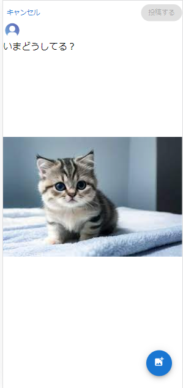
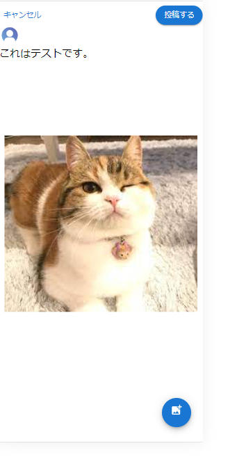
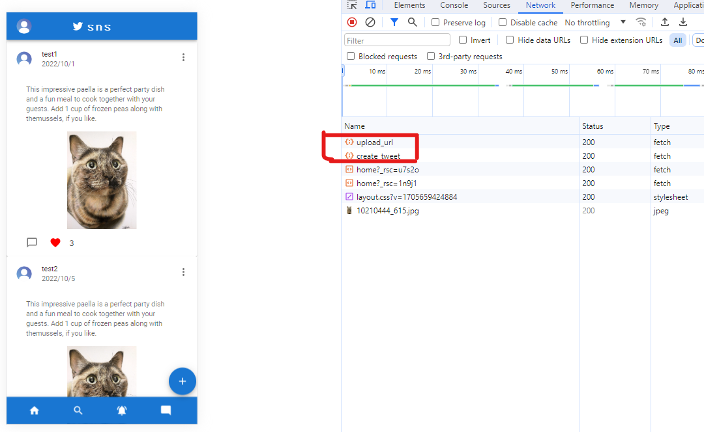
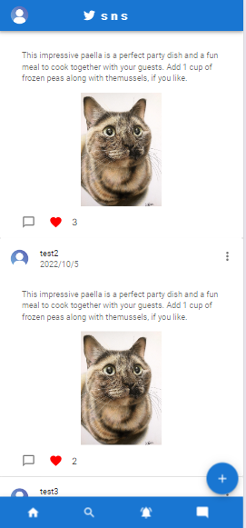

# tweet 一覧画面の作成

## 画面イメージ

今回作成する画面のイメージは以下のとおりです。


tweet したいメッセージと画像をサーバーにアップロードする画面となっています。

## 画面実装

では、ツイート作成画面を作成していきましょう。
`frontend/src/app/`配下に`tweet`フォルダを作成し、`page.tsx`を作成しましょう。

`frontend/src/app/tweet/page.tsx`

このコンポーネントではフォームの制御を楽に実装するためのライブラリとして`react-hook-form`を利用します。
そのため、以下のコマンドを実行してライブラリをインストールしましょう。

```bash
# package.jsonファイルがある階層で実行
$ npm install react-hook-form
```

インストールが完了したら`frontend/src/app/tweet/page.tsx`の編集を行いましょう。

```jsx
"use client";

import { Avatar, Button, Grid, TextareaAutosize } from "@mui/material";
import Link from "next/link";
import { useEffect, useState } from "react";
import { useForm } from "react-hook-form";
import { tweetData } from "../type/types";

const _CreateTweet = ({}) => {
  // 解説ポイント1 下で解説します。
  const {
    register,
    handleSubmit,
    watch,
  } = useForm<tweetData>();
  const [disable, setDisable] = useState(true);

  // 解説ポイント2 下で解説します。
  useEffect(() => {
    let len = watch("tweetContent.message").length;
    if (len === 0) {
      setDisable(true);
    } else {
      setDisable(false);
    }
    // eslint-disable-next-line react-hooks/exhaustive-deps
  }, [watch("tweetContent.message")]);

  return (
    <>
      <form onSubmit={handleSubmit((e) => console.log(e))}>
        <Grid container mt={1}>
          <Grid item xs={3}>
            <Link href="/home" style={{ textDecoration: "none" }}>
              <Button variant="text">キャンセル</Button>
            </Link>
          </Grid>

          <Grid item xs={9} sx={{ display: "flex", justifyContent: "end" }}>
            <Button
              variant="contained"
              type="submit"
              style={{ borderRadius: "20px" }}
              disabled={disable}
            >
              投稿する
            </Button>
          </Grid>
        </Grid>
        <Avatar
          alt="Remy Sharp"
          src={
            "https://kotonohaworks.com/free-icons/wp-content/uploads/kkrn_icon_user_1-768x768.png"
          }
        />
        <TextareaAutosize
          maxRows={4}
          placeholder="いまどうしてる？"
          style={{
            width: "100%",
            height: "20vh",
            outline: "none",
            border: "none",
            fontSize: "15pt",
          }}
          {...register("tweetContent.message", { required: true })}
        />
      </form>
    </>
  );
};

export default _CreateTweet;

```

上記のコードで重要なところについて以下で解説します。

- 解説ポイント 1 　`useForm`

  - useForm フックは、フォームの状態を管理するために使用される。

  - `<tweetData>`は、フォームのデータ型を指定しており、この型は、フォームで収集するデータの構造を表します。

  - `register` 関数は、フォーム内の入力要素を react-hook-form に登録します。これにより、フォームの各入力項目がフォームステートに関連付けられ、フォームの値が取得できるようになります。

  - handleSubmit 関数は、フォームが送信されたときに実行されるコールバック関数です。フォームの送信時に実行するべき処理をこの関数に定義します。通常、この中でフォームデータを送信したり、他のアクションを実行したりします。

  - watch 関数は、指定したフォームの入力項目の値を監視するために使用されます。これにより、特定の入力項目の値が変更されたときにリアクションを起こすことができます。

- 解説ポイント 2 　`useEffect`
  - `useEffect`の第一引数には。副作用の関数（DOM の書き換え、state の更新、API 通信など UI 構築以外の処理など）を指定します。
  - `useEffect`は第二引数（上記のコードでいう`[watch("tweetContent.message")]`のところ）に指定した値が更新されたときに第一引数に指定した副作用を実行します。
  - 上記より、`frontend/src/app/tweet/page.tsx`の`useEffect`は、ツイートのメッセージを監視して、ボタンの活性・非活性を制御するための`disable` state を更新しています。ボタンが活性のときしかツイートできないような制御となっています。

ここまでできたら画面で tweet 作成画面を確認してみましょう！

ツイート一覧画面から、2 章で作成したツイート作成画面へ遷移するためのボタンを押下すると以下の画面が開くはずです。


開けたら実際に文字を入力してみましょう。

文字を入力すると投稿ボタンが活性化したと思います。ボタンが活性化したら投稿ボタンを押下してみましょう。
すると、フォームに入力された値が`submit`によって送信され`onSubmit={handleSubmit((e) => console.log(e))}`の箇所でログ出力した情報がコンソール画面に表示されたと思います。

では、次にこれらのツイートデータを送信したり、画像をアップロードできたりするようにソースコードを更新していきましょう。


## Tweet の送信と画像アップロード

まずは以下のファイルを新規作成しましょう。
`frontend/src/app/tweet/tweet.hooks.ts`

まずは画像のアップロードとプレビュー表示部分のロジックを実装していきましょう。
大事となる要素は以下の通りです。

- `useState`
  - useState は React フックの一つであり、関数コンポーネント内で状態を管理するために使用されます。useState を使用すると、コンポーネントが再レンダリングされる際に状態を保持し、その状態を更新することができます。
- `onChangeFileInput`

  - こちらは画像のアップロード領域を監視して、onChange イベントを検知したときに動かす関数となります。
    - 関数内で実行している内容としては
  - こちらは画像のアップロード領域を監視して、onChange イベントを検知したときに動かす関数となります。
  - 関数内で実行している内容としては以下の通りです。

    1.検知したイベントからファイルがあるか。

    2.ある場合はそのファイルが画像ファイルなのか。

    3．1 と 2 をチェックして問題ない場合は画像を state にセットします。

    4．アップロードした画像をツイート投稿画面にプレビューとして表示させたいためバイナリ形式のデータを取得して state にセットします。

```typescript
import { useState } from "react";

/** tweet生成するためのhooks */
export const useCreateTweet = () => {
  const [binaryForImgData, setBinay] = useState<
    string | ArrayBuffer | null | undefined
  >(null);
  const [image, setImage] = useState<Blob | undefined>();

  /** 画像アップロード時にプレビュー表示するためのhooks */
  const onChangeFileInput = (
    event: React.ChangeEvent<HTMLInputElement>
  ): void => {
    if (event.target.files?.length === 0) {
      return;
    }
    if (!event.target.files?.[0].type.match("image.*")) {
      return;
    }
    setImage(event.target.files?.[0]);
    const reader = new FileReader();
    reader.readAsDataURL(event.target?.files[0]);
    // readAsDataURLでファイルを読み取ったときに、Base64エンコードされたデータURLをセットする。
    reader.onload = (e) => {
      setBinay(e.target?.result);
    };
  };
  return {
    onChangeFileInput,
    binaryForImgData,
    image,
  };
};
```

作成した hooks をコンポーネント側から使えるようにしていきましょう。

```jsx
import {
  Avatar,
  Button,
  Fab,
  Grid,
  Input,// 追加
  TextareaAutosize,
  styled,
} from "@mui/material";
import { AddPhotoAlternate } from "@mui/icons-material";// 追加
// ----------------省略-----------------
  useEffect(() => {
    let len = watch("tweetContent.message").length;
    if (len === 0) {
      setDisable(true);
    } else {
      setDisable(false);
    }
    // eslint-disable-next-line react-hooks/exhaustive-deps
  }, [watch("tweetContent.message")]);

  //  StyledFabを追加
  const StyledFab = styled(Fab)({
    position: "absolute",
    zIndex: 1,
    top: "90%",
    left: "80%",
    right: 0,
  });


  return (
    <>
　　　----------------上記は省略-----------------
        <TextareaAutosize
          maxRows={4}
          placeholder="いまどうしてる？"
          style={{
            width: "100%",
            height: "20vh",
            outline: "none",
            border: "none",
            fontSize: "15pt",
          }}
          {...register("tweetContent.message", { required: true })}
        />
　　　----------------以下から追加-----------------
        {!!binaryForImgData && (
          
        )}
        <StyledFab color="primary" aria-label="add">
          <label htmlFor="uploadButton">
            <Input
              id="uploadButton"
              type="file"
              {...register("tweetContent.imgName")}
              sx={{ display: "none" }}
              // ファイルがアップロードされたときのchangeイベントを監視
              onChange={onChangeFileInput}
            />
            <AddPhotoAlternate />
          </label>
        </StyledFab>
　　　----------------ここまで-----------------
      </form>
    </>
  );
};

export default _CreateTweet;
```

ここまで実装したらブラウザで画像アップロードボタンが表示されていることを確認してみましょう。


ここまでできたら実際にボタンを押下して画像をアップロードしてみましょう。



画像がプレビュー表示されていれば OK です！

では次に、ツイートの投稿と画像をサーバー側にアップロードしていく処理を実装していきましょう。

`frontend/src/app/tweet/tweet.hooks.ts`
まずはユーザーがツイート投稿したときの form を submit したときに動かす関数を定義しましょう。
uuid という一意な識別子を生成するためのライブラリをインストールしておきましょう。

```bash
$ npm install uuid
```

```typescript
import { useState } from "react";
// 以下追加
import { SubmitHandler } from "react-hook-form";
import { tweetData } from "../type/types";
import { useRouter } from "next/navigation";
import { v4 as uuidv4 } from "uuid";

/** tweet生成するためのhooks */
export const useCreateTweet = () => {
  // -----------------ここから-----------------
  const id = uuidv4();
  const router = useRouter();
  /** tweet生成のapi */
  const handleSubmitAction: SubmitHandler<tweetData> = async (
    tweet: tweetData
  ): Promise<void> => {
    console.log("handle submit action");
  };

  // ----------------ここまで------------------

  /** 画像アップロード時にプレビュー表示するためのhooks */
  const onChangeFileInput = (
    event: React.ChangeEvent<HTMLInputElement>
  ): void => {
    // 省略
  };
  return {
    onChangeFileInput,
    binaryForImgData,
    image,
    handleSubmitAction, // 追加
  };
};
```

この新しく追加した handleSubmitAction がツイート作成時の大枠となる関数となります。
ここからこの関数の中で実行すべき処理をひとつずつ加えていきます。

一つ目は、画像をアップロードするための処理を実装しますが、今回作成するアプリでは AWS の S3 へ画像をアップロードするため`署名付きURL`という仕組みを利用していきます。
実際に`署名付きURL`を発行する処理はバックエンド側の API で後の章で作成するので、フロント側はリクエストを送信する部分を作成していきます。

署名付き URL については以下を参考

[署名付き URL 参考](https://qiita.com/MasashiFujiike/items/3cf0373cf89462c4c983)

`frontend/src/app/tweet/tweet.hooks.ts`

```typescript
// 省略
import { apiClient } from "../utils/baseApi"; // 追加

/** tweet生成するためのhooks */
export const useCreateTweet = () => {
  // 省略

  /** tweet生成のapi */
  const handleSubmitAction: SubmitHandler<tweetData> = async (
    tweet: tweetData
  ): Promise<void> => {
    const uploadUrl = await getUploadUrl(id); // 追加
  };
  // 省略
  return {
    onChangeFileInput,
    binaryForImgData,
    image,
    handleSubmitAction,
  };
};

// この関数はコンポーネント側から利用しないため、useCreateTweetの外に定義する。
const getUploadUrl = async (tweetId: string): Promise<string | null> => {
  const response = await apiClient(
    "/api/upload_url",
    "POST",
    "no-store",
    JSON.stringify({ userId: "test@mail.com", tweetId })
  );
  return response.presignedUrl;
};
```

署名付き URL は API で取得する想定なため、フロントの現時点の対応としてモック API を作成しておきましょう。
以下のファイルを新規作成しましょう。

`frontend/src/app/api/upload_url/route.ts`

```typescript
import { NextRequest, NextResponse } from "next/server";

export function POST(request: NextRequest) {
  const body = request.body;
  return NextResponse.json({
    presignedUrl: "http://localhost:3000/api/uploadImage",
  });
}
```

署名付き URL のモック作成まで完了したので、署名付き URL を用いて画像を S3 へアップロードする処理を追加していきましょう。この処理はとても単純で取得した署名付き URL へ画像を PUT するだけです。ローカル環境では S3 へアップロードすることを確認するのは現時点では難しいため、`console.log`でログを出力するだけにとどめておきます。

`frontend/src/app/tweet/tweet.hooks.ts`

```typescript
// 省略
import { apiClient } from "../utils/baseApi"; // 追加

/** tweet生成するためのhooks */
export const useCreateTweet = () => {
  // 省略

  /** tweet生成のapi */
  const handleSubmitAction: SubmitHandler<tweetData> = async (
    tweet: tweetData
  ): Promise<void> => {
    const uploadUrl = await getUploadUrl(id);
    // 追加
    if (image !== undefined && uploadUrl !== null) {
      putTweetImageToStorage(uploadUrl, image as Blob);
    }
  };
  // 省略
  return {
    onChangeFileInput,
    binaryForImgData,
    image,
    handleSubmitAction,
  };
};

// この関数はコンポーネント側から利用しないため、useCreateTweetの外に定義する。
const getUploadUrl = async (tweetId: string): Promise<string | null> => {
  // 略
};

// 追加
const putTweetImageToStorage = async (
  uploadUrl: string,
  image: Blob
): Promise<void> => {
  if (process.env.NEXT_PUBLIC__ENV === "local") {
    console.log("upload image to storage");
  } else {
    await fetch(uploadUrl, {
      method: "PUT",
      body: image,
    }).catch((e) => {
      throw new Error("Failed to upload image");
    });
  }
};
```

ここまでで画像をアップロードする処理は完成したので、ツイートをアップロードする処理を追加していきます。

`frontend/src/app/tweet/tweet.hooks.ts`

ユーザー名や userId はまだ Google の`O-auth`認証を実装していないため、仮置きで登録しています。

```typescript
// 省略
import { apiClient } from "../utils/baseApi"; // 追加

/** tweet生成するためのhooks */
export const useCreateTweet = () => {
  // 省略

  /** tweet生成のapi */
  const handleSubmitAction: SubmitHandler<tweetData> = async (
    tweet: tweetData
  ): Promise<void> => {
    const uploadUrl = await getUploadUrl(id);
    if (image !== undefined && uploadUrl !== null) {
      putTweetImageToStorage(uploadUrl, image as Blob);
    }
    // ---------追加------------------
    const tweetReqData = await createTweetRequestData(id, tweet);
    try {
      await apiClient(
        "/api/create_tweet",
        "POST",
        "no-store",
        JSON.stringify(tweetReqData)
      );
      // ツイート登録後は/homeに遷移させる
      router.push("/home");
      // router.pushはコンポーネントの状態を保持したまま画面遷移を行うため、データfetchが行われない。
      // そのため、refreshを用いてサーバーからデータをfetchし直すようにしている
      router.refresh();
    } catch (e) {
      console.log(e);
    }
  };
  // ---------ここまで------------------

  // 省略
  return {
    onChangeFileInput,
    binaryForImgData,
    image,
    handleSubmitAction,
  };
};

// この関数はコンポーネント側から利用しないため、useCreateTweetの外に定義する。
const getUploadUrl = async (tweetId: string): Promise<string | null> => {
  // 略
};

const putTweetImageToStorage = async (
  uploadUrl: string,
  image: Blob
): Promise<void> => {
  // 略
};

// 追加
/** ツイート作成APIのリクエストデータを生成する関数 */
const createTweetRequestData = async (
  id: string,
  tweet: tweetData
): Promise<tweetData | null> => {
  const requestData = {
    id,
    tweetInfo: {
      userName: "testUserName",
      createdAt: new Date().toISOString().slice(0, 19).replace("T", " "),
    },
    tweetContent: {
      message: tweet.tweetContent.message,
      imgName: tweet.tweetContent.imgName,
    },
    tweetUserAction: {
      good: "0",
      comments: [],
    },
    userId: "test@mail.com",
  };
  return requestData;
};
```

ツイート作成 API を呼ぶ処理を追加したので、モック API を追加しましょう。

以下のファイルを新規作成しましょう。

`frontend/src/app/api/create_tweet/route.ts`

```typescript
import { NextRequest, NextResponse } from "next/server";

export function POST(request: NextRequest) {
  const body = request.body;
  return NextResponse.json({ isSuceess: true });
}
```

これでツイート作成系の処理はすべて追加できたため、コンポーネント側からツイート作成処理を呼び出してみましょう。

`frontend/src/app/tweet/tweet.hooks.ts`

このファイルで一番重要なのは`<form onSubmit={handleSubmit(handleSubmitAction)}>`で入力したフォームデータを`handleSubmitAction`に送って、ツイート作成処理を呼び出しているところです。
最後なので全体像を載せておきます。

```jsx
"use client";

import {
  Avatar,
  Button,
  Fab,
  Grid,
  Input,
  TextareaAutosize,
  styled,
} from "@mui/material";
import Link from "next/link";
import { useEffect, useState } from "react";
import { useForm } from "react-hook-form";
import { AddPhotoAlternate } from "@mui/icons-material";
import { tweetData } from "../type/types";
import { useCreateTweet } from "./tweet.hooks";

const _CreateTweet = ({}) => {
  // handleSubmitActionを追加
  const { onChangeFileInput, binaryForImgData, image, handleSubmitAction } =
    useCreateTweet();

  const { register, handleSubmit, watch } = useForm<tweetData>();
  const [disable, setDisable] = useState(true);
  useEffect(() => {
    let len = watch("tweetContent.message").length;
    if (len === 0) {
      setDisable(true);
    } else {
      setDisable(false);
    }
    // eslint-disable-next-line react-hooks/exhaustive-deps
  }, [watch("tweetContent.message")]);

  const StyledFab = styled(Fab)({
    position: "absolute",
    zIndex: 1,
    top: "90%",
    left: "80%",
    right: 0,
  });

  return (
    <>
      {/* console.logからhandleSubmitActionへ更新 */}
      <form onSubmit={handleSubmit(handleSubmitAction)}>
        <Grid container mt={1}>
          <Grid item xs={3}>
            <Link href="/home" style={{ textDecoration: "none" }}>
              <Button variant="text">キャンセル</Button>
            </Link>
          </Grid>

          <Grid item xs={9} sx={{ display: "flex", justifyContent: "end" }}>
            <Button
              variant="contained"
              type="submit"
              style={{ borderRadius: "20px" }}
              disabled={disable}
            >
              投稿する
            </Button>
          </Grid>
        </Grid>
        <Avatar
          alt="Remy Sharp"
          src={
            "https://kotonohaworks.com/free-icons/wp-content/uploads/kkrn_icon_user_1-768x768.png"
          }
        />
        <TextareaAutosize
          maxRows={4}
          placeholder="いまどうしてる？"
          style={{
            width: "100%",
            height: "20vh",
            outline: "none",
            border: "none",
            fontSize: "15pt",
          }}
          {...register("tweetContent.message", { required: true })}
        />
        {!!binaryForImgData && (
          
        )}
        <StyledFab color="primary" aria-label="add">
          <label htmlFor="uploadButton">
            <Input
              id="uploadButton"
              type="file"
              {...register("tweetContent.imgName")}
              sx={{ display: "none" }}
              onChange={onChangeFileInput}
            />
            <AddPhotoAlternate />
          </label>
        </StyledFab>
      </form>
    </>
  );
};

export default _CreateTweet;

```

お疲れ様でした。これでツイート作成処理の実装が完了しました。
実際にブラウザで動作確認してみましょう。



上記のようにメッセージと画像を入力し、「投稿する」ボタンを押下してみましょう。



開発者ツールの Network で`upload_url`と`create_tweet`の status が 200 になっていて、`/home`のツイート一覧画面に遷移できていたら OK です。

## アップロードした画像を表示できるようにする。
上記でtweet作成時に画像のアップロード用URLを取得してアップロードするところまで実装しました。このアップロードした画像をHOME画面で表示できるようにするための実装を追加して、3章は終わりにしたいと思います。

まずは、apiフォルダの配下に以下を追加します。

`frontend/src/app/api/download_url/route.ts`

```typescript
import { NextRequest, NextResponse } from "next/server";

export function POST(request: NextRequest) {
  const requestBody = request.json();

  return NextResponse.json({
    presignedUrl: "https://news.walkerplus.com/article/1023800/10210444_615.jpg",
  });
}

```

次に先ほど作成したAPIをたたくカスタムhooksを新規作成します。

`frontend/app/components/container/TweetCard/tweetCard.hooks.ts`

```typescript
import { tweetData } from "@/app/type/types";
import { apiClient } from "@/app/utils/baseApi";
import { useEffect, useState } from "react";

export const useFetchTweetImage = (tweet: tweetData) => {
  const [imageUrl, setImageUrl] = useState<string>("");

  useEffect(() => {
    if (tweet.tweetContent.imgName === "") return;
    const fetchImage = async () => {
      const res = await apiClient(
        "/api/download_url",
        "POST",
        "force-cache", // キャッシュを利用して値を返す
        JSON.stringify({
          userId: tweet.userId,
          tweetId: tweet.id,
        })
      );

      setImageUrl(res.presignedUrl);
    };
    fetchImage();
  }, []);

  return { imageUrl };
};

```

最後に作成したカスタムフックをTweetCardコンポーネントから呼び出してみましょう。

`frontend/app/components/container/TweetCard/tweetCard.tsx`

カスタムフックの呼び出しを新規追加するのと、CardMediaで表示する画像をカスタムフックから取得したURLに基づいて表示するように更新しました。

```tsx
// ・・・略

// 追加
import { useFetchTweetImage } from "./tweetCard.hooks";
import { Skeleton } from "@mui/material";

export const TweetCard = (props: Props) => {
  // ・・・略
  const handleClose = () => {
    setAnchorEl(null);
  };
  // 追加
  const { imageUrl } = useFetchTweetImage(props.tweet);
  return (
      // ・・・略
      </CardContent>
      // CardMedia記載箇所を以下に更新。ここから
      {imageUrl ? (
        <CardMedia
          component="img"
          height="200"
          image={imageUrl}
          alt="image"
          style={{ objectFit: "contain" }}
        />
      ) : (
        <Skeleton variant="rectangular" height={200} />
      )}
      // ここまで
      <CardActions sx={{ mr: 3, ml: 3 }}>
  )
};

```

ここまで更新できたら、HOME画面を表示してリロードしてみましょう。



上記のようにモックAPIから取得したURLに基づいて、画像が表示されていればOKです。


## さいごに
ここまで実装完了できた受講者様のみなさん、大変お疲れ様でした！これでフロント側の実装は一旦完了です。
ボーナスレクチャーでログイン機能など、別途フロント開発の課題はありますが、次の 4 章からはバックエンドで API を作成する段階に入っていきたいと思います。
