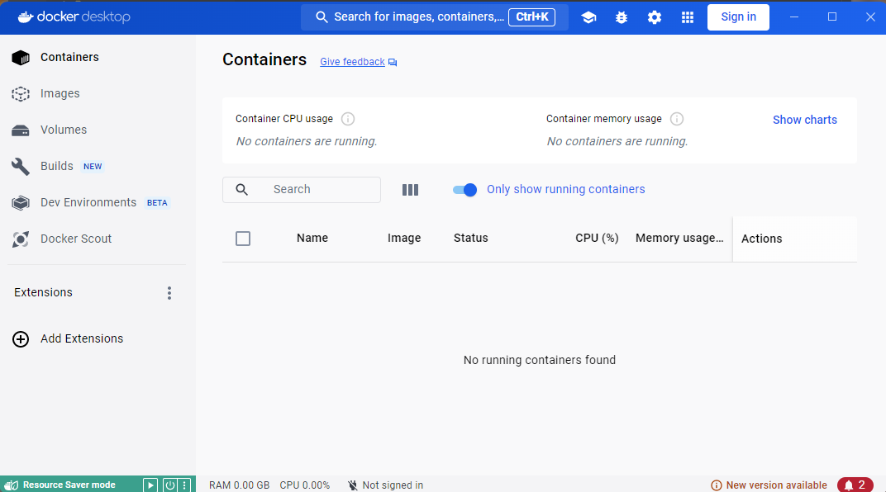
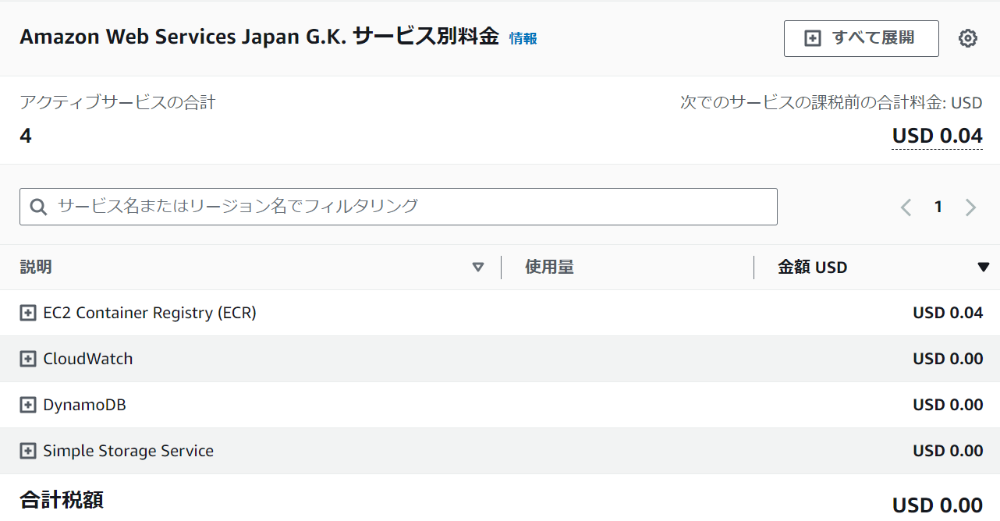
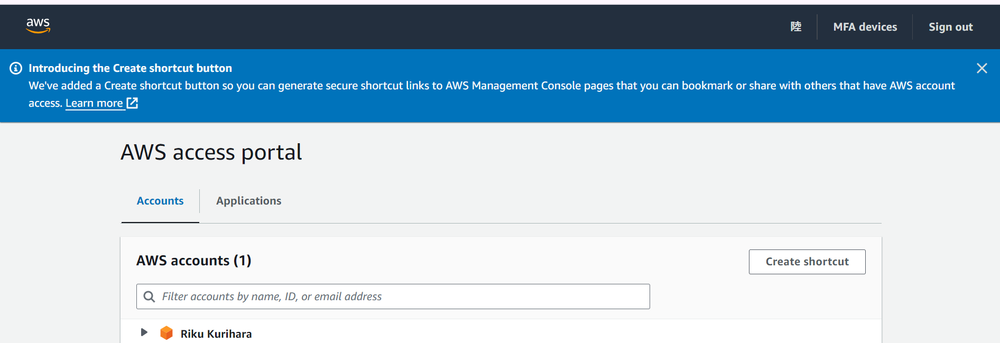
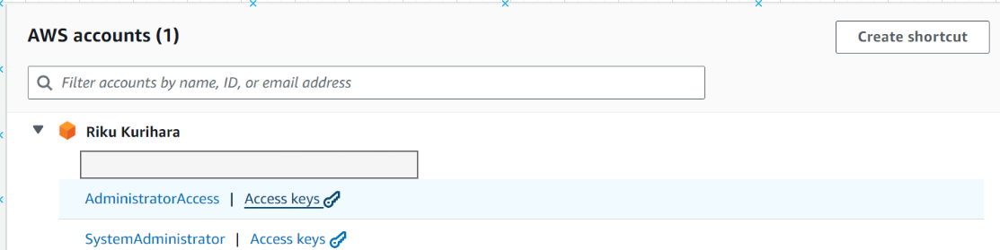
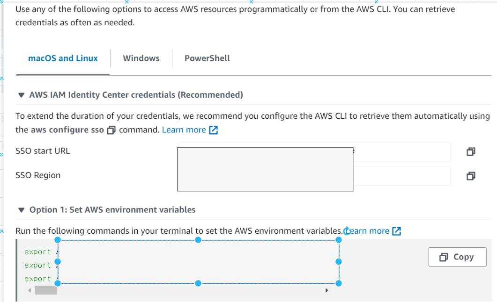
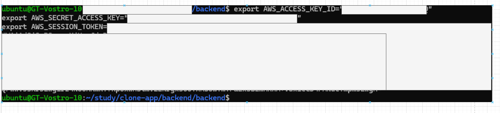

# バックエンド環境構築

## python のインストール

- 3.10 以上のバージョンをインストールしてください。
  - https://www.python.org/downloads/
- poetry という python のパッケージマネージャーをインストールします。
  - https://python-poetry.org/docs/
- 以下コマンドを実行して、以下のような表示がされていれば OK です。(筆者のバージョンより上のものならなんでも問題ございません。)
  ```bash
  $ python3 --version
  Python 3.10.12
  $ poetry --version
  Poetry (version 1.3.2)
  ```

## Docker Desktop のインストール

- https://www.docker.com/get-started/
- インストールが完了したら開いてみましょう。以下のような画面が表示されればインストール成功です。
  

## AWS のアカウント作成

1. まずはアカウントの登録
   - https://aws.amazon.com/jp/register-flow/
2. アカウント登録後に設定しておいた方がよい項目
   - https://qiita.com/ti_and6id/items/08f96d965aed0d85ae23
   - 上記は AWS 公式のハンズオンに沿ってまとめられているので分かりやすいと思います。
     - 「操作履歴とリソース変更履歴の記録」と「脅威検知」は料金面から設定しなくても良いとは個人的に思います。筆者の個人アカウントは「ID アクセス権管理」と「請求データの確認とアラート」の章で解説されているものぐらいしか設定しておりません。
3. AWS SSO の設定
   - https://qiita.com/sakai00kou/items/086a12caa69a78c18f61
     - sso を設定しておくと今後ターミナル上などからログインしやすくなります。

お知らせ：

AWS アカウントは作成してから１年間は無料で利用できます。（ただし無料枠を超えないこと）
また、今回作成する教材のアプリケーションはサーバーレスアーキテクチャを採用しているため１カ月当たりの料金は１＄を超えることもそんなにないと思われます。（DB や画像のストレージなどに置いているデータの量だけ若干料金がかかるイメージ）
ちなみに筆者は毎月、0.1$未満のため、料金がかかったことはまだありません！なので料金についてはそんなに心配して頂かなくても大丈夫です。


## AWS SAM(AWS Serverless Application Model)のインストール

- https://docs.aws.amazon.com/ja_jp/serverless-application-model/latest/developerguide/install-sam-cli.html
  - 上記の公式ドキュメントに沿って、お使いの OS に合わせてインストールしてください。
  - 以下コマンドを実行して、以下のような表示がされていれば OK です。(筆者のバージョンより上のものならなんでも問題ございません。)
  ```bash
  $ sam --version
  SAM CLI, version 1.103.0
  ```

## バックエンドのプロジェクトを作成

ここまで環境構築が完了した方はお疲れ様でした。フロントエンド側の環境構築と比較するとかなり大変だったのではないでしょうか。実際に日々の開発業務の中で、なんだかんだ一番大変なのは環境構築だったりするのですよね、、、

それでは sam を用いてバックエンドのプロジェクトを作成しましょう。

```bash
$ cd twitter-clone
$ ls
  frontend ...etc
$ sam init
# 以下のような質問形式でプロジェクトが作成されていくので、同じ手順で回答してください。
Which template source would you like to use?
        1 - AWS Quick Start Templates
        2 - Custom Template Location
Choice: 1 # あらかじめAWSで用意されているテンプレートを利用します。

Choose an AWS Quick Start application template
        1 - Hello World Example
        2 - Data processing
        3 - Hello World Example with Powertools for AWS Lambda
        4 - Multi-step workflow
        5 - Scheduled task
        6 - Standalone function
        7 - Serverless API
        8 - Infrastructure event management
        9 - Lambda Response Streaming
        10 - Serverless Connector Hello World Example
        11 - Multi-step workflow with Connectors
        12 - GraphQLApi Hello World Example
        13 - Full Stack
        14 - Lambda EFS example
        15 - Hello World Example With Powertools for AWS Lambda
        16 - DynamoDB Example
        17 - Machine Learning
Template: 1 # 一番簡単なHello Worldでサンプルプロジェクトを作成します。

Use the most popular runtime and package type? (Python and zip) [y/N]: N

Which runtime would you like to use?
        1 - aot.dotnet7 (provided.al2)
        2 - dotnet6
        3 - go1.x
        4 - go (provided.al2)
        5 - go (provided.al2023)
        6 - graalvm.java11 (provided.al2)
        7 - graalvm.java17 (provided.al2)
        8 - java21
        9 - java17
        10 - java11
        11 - java8.al2
        12 - java8
        13 - nodejs20.x
        14 - nodejs18.x
        15 - nodejs16.x
        16 - nodejs14.x
        17 - python3.9
        18 - python3.8
        19 - python3.7
        20 - python3.12
        21 - python3.11
        22 - python3.10
        23 - ruby3.2
        24 - ruby2.7
        25 - rust (provided.al2)
        26 - rust (provided.al2023)
Runtime: 17 # 今回の教材はpython3.9を利用します。

What package type would you like to use?
        1 - Zip
        2 - Image
Package type: 2 # Dockerイメージを利用します。

Based on your selections, the only dependency manager available is pip.
We will proceed copying the template using pip.

Would you like to enable X-Ray tracing on the function(s) in your application?  [y/N]: N # 利用しません

Would you like to enable monitoring using CloudWatch Application Insights?
For more info, please view https://docs.aws.amazon.com/AmazonCloudWatch/latest/monitoring/cloudwatch-application-insights.html [y/N]: N# 利用しません

Would you like to set Structured Logging in JSON format on your Lambda functions?  [y/N]: # 利用しません

Project name [sam-app]: backend # backendという名前でプロジェクトを作成しましょう
# 以下プロジェクト作成完了のメッセージが表示されるが省略

$ cd backend/ && ls
# 以下のようなファイルやディレクトリが表示されればOKです。
README.md  __init__.py  events  hello_world  samconfig.toml  template.yaml  tests

```

## サンプルプロジェクト(Hello World lambda)のコードを動かしてみる

1. プロジェクトをビルドします。

```bash
# backend/配下でsam buildを実行
$ sam build
# ------省略--------
Step 4/5 : COPY app.py ./
 ---> b59fc6fdffd4
Step 5/5 : CMD ["app.lambda_handler"]
 ---> Running in 926f787b9477
 ---> Removed intermediate container 926f787b9477
 ---> eec6f9b28a88
Successfully built eec6f9b28a88
Successfully tagged helloworldfunction:python3.9-v1


Build Succeeded

Built Artifacts  : .aws-sam/build
Built Template   : .aws-sam/build/template.yaml

Commands you can use next
=========================
[*] Validate SAM template: sam validate
[*] Invoke Function: sam local invoke
[*] Test Function in the Cloud: sam sync --stack-name {{stack-name}} --watch
[*] Deploy: sam deploy --guided
# --------------
```

2. AWS に SSO する

- sso の画面に遷移す
  
- 任意の`Access keysをクリックする`
  
- option1: Set AWS environment variables の Copy をクリック
  
- Copy したらコマンド実行箇所（ターミナルや wsl など）に貼り付けてそのまま実行します。
  

3. 1 でビルドしたプロジェクトを実行
   実行する前に２番の SSO を実行していないと、ここでプロジェクトを実行することはできません。以下が SSO せずに実行し、エラーになった例です。

```baxh
An unexpected error was encountered while executing "sam local invoke".
Search for an existing issue:
https://github.com/aws/aws-sam-cli/issues?q=is%3Aissue+is%3Aopen+Bug%3A%20sam%20local%20invoke%20-%20UnauthorizedSSOTokenError
Or create a bug report:
https://github.com/aws/aws-sam-cli/issues/new?template=Bug_report.md&title=Bug%3A%20sam%20local%20invoke%20-%20UnauthorizedSSOTokenError
```

さきほど正常にログインできていれば以下のコマンドを実行してもエラーにはなりません。

```bash
$ sam local invoke HelloWorldFunction --event events/event.json
# 上記がサンプルの実行コマンドになります。
Invoking Container created from helloworldfunction:python3.9-v1
Local image was not found.
Removing rapid images for repo helloworldfunction
Building image.................
Using local image: helloworldfunction:rapid-x86_64.

START RequestId: d5d3ed93-a8b6-4f0a-98b4-52eb2f282a67 Version: $LATEST
END RequestId: d5d3ed93-a8b6-4f0a-98b4-52eb2f282a67
REPORT RequestId: d5d3ed93-a8b6-4f0a-98b4-52eb2f282a67  Init Duration: 2.84 ms  Duration: 148.53 ms     Billed Duration: 149 ms     Memory Size: 128 MB     Max Memory Used: 128 MB
{"statusCode": 200, "body": "{\"message\": \"hello world\"}"}
```

上記のように hello world が表示されていればうまく実行できています。

## 環境構築まとめ

長い長い環境構築お疲れ様でした。
まだこの段階では SAM についてなんとなく使っているような感覚ではないでしょうか？
次の章から SAM について深く触れていきたいと思います。
