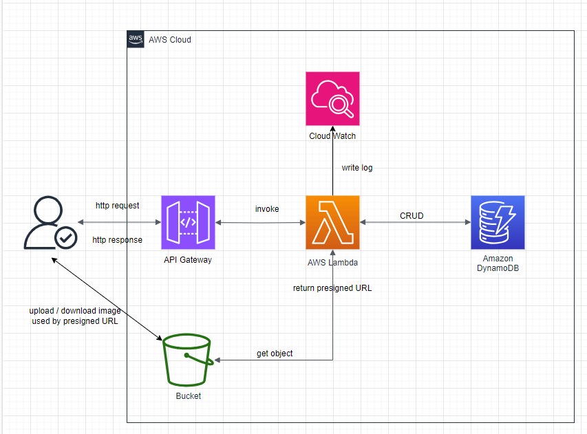

# 5 章 記事一覧取得 API の作成

こちらの章ではツイート一覧取得 API を作成していきたいと思います。
その前に、AWS SAM を利用するうえで使用する技術などの基礎知識について解説していきたいと思います。

## AWS SAM とは

AWS Serverless Application Model (AWS SAM) は、[公式ドキュメント](https://docs.aws.amazon.com/ja_jp/serverless-application-model/latest/developerguide/what-is-sam.html)によると、サーバーレスアプリケーションの構築と実行における開発者の操作性を向上させるツールキットであると定義されています。

公式ドキュメントに一度目を通すと、全体の概要がなんとなくわかると思いますが、簡潔にまとめると以下のような特徴が挙げられます。

- AWS SAM テンプレート(template.yaml)という概念でアプリケーションのインフラ環境をコードベースで管理できる。
- ローカル環境でデバッグとテストができ、アプリケーションをデプロイすることもできる

また、サーバーレスという用語の概念に疑問を持つ方がいると思います。以下はサーバーレスアーキテクチャの特徴です。

- 開発者が独自のサーバーを管理することがなく、アプリケーションの構築・実行が可能
  - 例えば、アプリケーションサーバーを EC2 で管理するとなると、サーバーのメンテナンスやスケーリングを自分自身で管理する必要が出てきます。サーバーレスアーキテクチャではこの管理の必要がありません。
  - また、EC2 などは常時起動しているため起動している時間だけ料金が課金されてしまいますが、サーバーレスアーキテクチャではイベントが発生した時間の分だけ料金が課金されるためコストにも優しいのが特徴です。
- [イベント駆動型のアーキテクチャ](https://aws.amazon.com/jp/event-driven-architecture/)であり、分離された各サービス間でイベントをトリガーにして通信を行うという特徴があります。
  - 教材のアーキテクチャはシンプルなものになっていますが、以下のようなインフラ図の構成で各サービス間で通信を行います。
    

## SAM で利用する AWS のサービス

- AWS Lambda
  - https://www.sunnycloud.jp/column/20239117-01/
    - 上記の記事の「サーバーレスの関数置き場」という表現が分かりやすい！
- API Gateway
  - https://qiita.com/shimajiri/items/2fb424629d9ddb9c9ef1
    - フルマネージドの Web サービスで、簡単に API の作成、公開、保守、モニタリング、保護ができるサービス。
- Dynamo DB
  - https://www.sunnycloud.jp/column/20210228-01/
    - ドキュメント型の NoSQL のサービス
      - NoSQL
        - MySQL などのリレーショナルデータベースとは全く異なり、非構造化データ・半構造化データなど柔軟なデータを扱える
      - ドキュメント型
        - SON や XML などの記述書式で書かれた不定形なデータを管理するデータベース
- S3
  - https://www.wafcharm.com/jp/blog/s3-for-beginners/#:~:text=%E3%81%A7%E3%81%8D%E3%82%8B%E3%81%A7%E3%81%97%E3%82%87%E3%81%86%E3%80%82-,S3%E3%81%A8%E3%81%AF%EF%BC%9F%E5%88%9D%E5%BF%83%E8%80%85%E3%81%AB%E3%82%82%E3%82%8F%E3%81%8B%E3%82%8A%E3%82%84%E3%81%99%E3%81%8F%E8%A7%A3%E8%AA%AC,-S3%E3%81%A8%E3%81%AF
    - AWS のストレージサービス
- cloud watch
  - https://aws.amazon.com/jp/cloudwatch/#:~:text=Amazon%20CloudWatch%20%E3%81%AF%E3%80%81%E3%82%A2%E3%83%97%E3%83%AA%E3%82%B1%E3%83%BC%E3%82%B7%E3%83%A7%E3%83%B3%E3%82%92,%E3%82%92%E6%8F%90%E4%BE%9B%E3%81%99%E3%82%8B%E3%82%B5%E3%83%BC%E3%83%93%E3%82%B9%E3%81%A7%E3%81%99%E3%80%82

## 記事一覧取得 API の実装

基礎的な知識については学習できましたでしょうか。実際に実装の方に進んでいきましょう！

- `backend/template.yaml`を編集しましょう。
  - まずは HelloWorld 系の記述はもう利用しないので削除しましょう。

```yaml
AWSTemplateFormatVersion: "2010-09-09"
Transform: AWS::Serverless-2016-10-31
Description: >
  python3.9

  Sample SAM Template for backend
# -----------------削除ここから----------------------------------------
# More info about Globals: https://github.com/awslabs/serverless-application-model/blob/master/docs/globals.rst
# -----------------ここまで--------------------------------------------

Globals:
  Function:
    Timeout: 3
    MemorySize: 128

Resources:
  # -----------------削除ここから----------------------------------------
  HelloWorldFunction:
    Type: AWS::Serverless::Function # More info about Function Resource: https://github.com/awslabs/serverless-application-model/blob/master/versions/2016-10-31.md#awsserverlessfunction
    Properties:
      PackageType: Image
      Architectures:
        - x86_64
      Events:
        HelloWorld:
          Type: Api # More info about API Event Source: https://github.com/awslabs/serverless-application-model/blob/master/versions/2016-10-31.md#api
          Properties:
            Path: /hello
            Method: get
    Metadata:
      Dockerfile: Dockerfile
      DockerContext: ./hello_world
      DockerTag: python3.9-v1
# -----------------ここまで--------------------------------------------

Outputs:
  # -----------------削除ここから----------------------------------------
  # ServerlessRestApi is an implicit API created out of Events key under Serverless::Function
  # Find out more about other implicit resources you can reference within SAM
  # https://github.com/awslabs/serverless-application-model/blob/master/docs/internals/generated_resources.rst#api
  HelloWorldApi:
    Description: "API Gateway endpoint URL for Prod stage for Hello World function"
    Value: !Sub "https://${ServerlessRestApi}.execute-api.${AWS::Region}.amazonaws.com/Prod/hello/"
  HelloWorldFunction:
    Description: "Hello World Lambda Function ARN"
    Value: !GetAtt HelloWorldFunction.Arn
  HelloWorldFunctionIamRole:
    Description: "Implicit IAM Role created for Hello World function"
    Value: !GetAtt HelloWorldFunctionRole.Arn
# -----------------ここまで--------------------------------------------
```

- 次に ツイート一覧取得 API 用に template.yaml を編集しましょう。

[CloudFormation](https://zenn.dev/satoshi256kbyte/articles/c426881a78f83b#:~:text=%E3%81%93%E3%81%A8%E3%81%AB%E3%81%97%E3%81%BE%E3%81%99%E3%80%82-,%E5%80%A4%E3%81%AE%E5%8F%82%E7%85%A7%20Ref%E9%96%A2%E6%95%B0%E3%83%BBSub%E9%96%A2%E6%95%B0%E3%83%BBGetAtt%E9%96%A2%E6%95%B0,-Ref%E3%83%BBSub%E9%96%A2%E6%95%B0)の組み込み関数について一読しておくと、!Ref,!Sub,!GetAtt の使い方が分かると思います。

template.yaml については初めて学習するため、初めて出てくる概念についてはコメントで詳しく説明しています。

```yaml
AWSTemplateFormatVersion: "2010-09-09"
Transform: AWS::Serverless-2016-10-31
Description: >
  python3.9

  Sample SAM Template for backend

Globals:
  Function:
    # 30秒に更新
    Timeout: 30
    MemorySize: 128
# -----------------追加ここから----------------------------------------
# パラメーターを使用するとテンプレートにカスタム値を入力できる（変数のようなもの）
Parameters:
  StageName:
    Type: "String"
    Default: "v1"
  TweetsTableName:
    Type: String
    Default: "Tweets"
  LogRetentionInDays:
    Type: Number
    Default: 1
# -----------------ここまで--------------------------------------------
Resources:
  # -----------------追加（api gateway）ここから-----------------------------
  MyApi:
    # HTTPS エンドポイント経由で呼び出すことができる Amazon API Gateway リソースを作成
    Type: AWS::Serverless::Api
    Properties:
      # StageName: URIの最初のパスセグメントとして使用するステージの名前
      # !Ref関数は指定したパラメータの値を返す
      StageName: !Ref StageName # Parametersの参照
      MethodSettings:
        - DataTraceEnabled: false # Amazon CloudWatch Logsに出力するか。本番APIは機密データ保持の観点からfalseが推奨されている
          # 複数のリソースとメソッドに設定を適用するには、HttpMethod にアスタリスク (*) を、ResourcePath に /* を指定する
          ResourcePath: "/*"
          HttpMethod: "*"
      # すべての API Gateway API のクロスオリジンリソース共有 (CORS) を管理
      Cors:
        # 指定されたオリジンからのリクエストを行うコードでレスポンスが共有できるかどうか
        AllowOrigin: "'*'"
        # レスポンスをフロントエンドの JavaScript コードに公開するかどうか
        AllowCredentials: false
        # 許可するHTTPメソッド(今回の教材はOPTIONSとPOSTのみ)
        AllowMethods: "'OPTIONS,POST'"
        #  Access-Control-Request-Headers を含むプリフライトリクエストへのレスポンスで、実際のリクエストの間に使用できる HTTP ヘッダーを示すために使用
        # プリフライトリクエストについて: WebサーバがCORS要求を受け付けるかどうかを実際に要求を送信する前に確かめること。クライアントからOPTIONSメソッドのHTTPリクエストを送信する。だからAllowMethodsでOPTIONSを設定しています。
        AllowHeaders: "'Content-Type,X-CSRF-TOKEN,Access-Control-Allow-Origin'"
  # -----------------ここまで--------------------------------------------

  # -----------------追加（ツイート取得のaws lambda）ここから------------------------
  TweetActionFunction:
    Type: AWS::Serverless::Function # aws lambda function
    Properties:
      # DynamoDBへのフルアクセス権限を与える(CRUDの全てが可能ということ)
      Policies:
        - arn:aws:iam::aws:policy/AmazonDynamoDBFullAccess
      PackageType: Image # Docker Imageからlambdaを作成するという意味
      Events:
        TweetActionFetch:
          Type: Api # api gateway経由でイベントを受け取る
          Properties:
            RestApiId: !Ref MyApi # 上記で作成したapi gatewayを参照
            # このパスのイベントを受け取ったときにTweetActionFetchラムダを実行
            Path: /api/fetch_tweet
            # httpメソッドはPOSTを利用する
            Method: post
      Environment:
        Variables:
          # dynamoDBのエンドポイント
          DYNAMO_ENDPOINT_URL: "http://dynamodb.ap-northeast-1.amazonaws.com"
    Metadata:
      # 参照するDockerfileについて
      Dockerfile: ./tweet/Dockerfile
      DockerContext: ./
      DockerTag: python3.9-v1
  # cloud watchの設定
  TweetActionLogGroup:
    Type: AWS::Logs::LogGroup
    Properties:
      LogGroupName: !Sub /aws/lambda/${TweetActionFunction}
      RetentionInDays: !Ref LogRetentionInDays
      Tags:
        - Key: TwitterLikeSnsDeveloper
          Value: Green

  # -----------------追加（dynamo db）ここから------------------------
  Tweets:
    Type: AWS::DynamoDB::Table # dynamo db
    Properties:
      TableName: !Ref TweetsTableName
      AttributeDefinitions: # テーブルとインデックスのキースキーマを記述する属性
        - AttributeName: user_id # 属性名
          AttributeType: S # 属性のデータ型,S-は文字列型,Nは数値型,Bはバイナリ型
        - AttributeName: id
          AttributeType: S
      KeySchema: # テーブルのプライマリキーを構成する属性
        # RDBと違ってdynamodbはパーティションキー(RDBでいうPrimary Keyのようなもの)とソートキーの2つしかキーを持てません。
        - AttributeName: user_id
          KeyType: HASH # HASH - パーティションキー
        - AttributeName: id
          KeyType: RANGE # RANGE - ソートキー
      BillingMode: PAY_PER_REQUEST #  1秒あたりに数千ものリクエストを処理できる柔軟な請求オプションで利用した分だけ課金計算される仕組み
      PointInTimeRecoverySpecification:
        PointInTimeRecoveryEnabled: true # 35日前~5分前の時点のテーブル内容を復元できる機能
# -----------------ここまで--------------------------------------------
Outputs: # スタックの作成または更新後に表示される情報を定義するために使用
  # -----------------追加ここから----------------------------------------
  FetchTweetApi:
    Description: "API Gateway endpoint URL for Prod stage for TweetAction function"
    Value: !Sub "https://${MyApi}.execute-api.${AWS::Region}.amazonaws.com/${StageName}/api/fetch_tweet/" # 出力する情報の値(ツイート取得APIのエンドポイント)
  TweetActionFunction:
    Description: "Tweet Action Function Lambda Function ARN"
    Value: !GetAtt TweetActionFunction.Arn # ArnとはAWS リソースを一意に識別するもの。（TweetActionFunctionラムダのArn）
  TweetActionFunctionIamRole:
    Description: "Implicit IAM Role created for Tweet Action Function function"
    # Lambda 関数の実行ロールは、AWS サービスおよびリソースにアクセスする許可を関数に付与する AWS Identity and Access Management (IAM) ロールである。
    Value: !GetAtt TweetActionFunctionRole.Arn
# -----------------ここまで--------------------------------------------
```

ツイート取得 API の template 編集は上記で完了しました。`TweetActionFunction`lambda を構成するためのファイルを追加していきましょう。

まずは以下のコマンドを実行し、フォルダとファイルを作成しましょう。

```bash
$ cd backend
$ mkdir tweet && cd tweet && touch {Dockerfile,fetch_tweet_handler.py,main.py}
```

では、tweet/Dockerfile を編集していきましょう。

```Dockerfile
# ベースイメージには以下を利用する。
# https://hub.docker.com/r/amazon/aws-lambda-python
# AWS が提供する Lambda のベースイメージには、AWS Lambda 上でコンテナイメージとしてパッケージ化された関数を実行するために必要なすべてのコンポーネントが含まれている
FROM public.ecr.aws/lambda/python:3.9

# tweet配下のrequirements.txtをLAMBDA_TASK_ROOT（Lambda 関数コードへのパス）へコピー（次の準備でrequirements.txtを生成します。）
COPY tweet/requirements.txt ${LAMBDA_TASK_ROOT}/requirements.txt
# requirements.txtから必要なライブラリをインストールします。
RUN python3.9 -m pip install --no-cache-dir -r "${LAMBDA_TASK_ROOT}/requirements.txt" -t .

# 先ほど作成したファイルをLambda 関数コードへのパスへコピーする
COPY tweet/main.py ${LAMBDA_TASK_ROOT}/main.py
COPY tweet/fetch_tweet_handler.py ${LAMBDA_TASK_ROOT}/fetch_tweet_handler.py

# 以下のdb/配下のファイルも後程作成します。
COPY ./db/table.py ${LAMBDA_TASK_ROOT}/db/table.py
COPY ./db/utils.py ${LAMBDA_TASK_ROOT}/db/utils.py

# main.pyのhandler関数を実行するという意味です。後程handler関数も実装します。
CMD ["main.handler"]

```

次に requirements.txt を作成していきましょう。ここでは 4 章の環境構築でインストールした poetry を利用していきます。

```bash
$ cd tweet
# poetryを使うための下準備
$ poetry init
This command will guide you through creating your pyproject.toml config.

Package name [tweet]:
Version [0.1.0]:
Description []:
Author [[hogehoge] <[]>, n to skip]:  n # n
License []:
Compatible Python versions [^3.10]:  ^3.9 # 3.9以上

# 以降は基本的にデフォルトのままEnterをたたき続けるので問題ない。
Would you like to define your main dependencies interactively? (yes/no) [yes]
You can specify a package in the following forms:
  - A single name (requests): this will search for matches on PyPI
  - A name and a constraint (requests@^2.23.0)
  - A git url (git+https://github.com/python-poetry/poetry.git)
  - A git url with a revision (git+https://github.com/python-poetry/poetry.git#develop)
  - A file path (../my-package/my-package.whl)
  - A directory (../my-package/)
  - A url (https://example.com/packages/my-package-0.1.0.tar.gz)

Package to add or search for (leave blank to skip):

Would you like to define your development dependencies interactively? (yes/no) [yes]
Package to add or search for (leave blank to skip):

Generated file

[tool.poetry]
name = "tweet"
version = "0.1.0"
description = ""
authors = ["Your Name <you@example.com>"]
readme = "README.md"

[tool.poetry.dependencies]
python = "^3.9"


[build-system]
requires = ["poetry-core"]
build-backend = "poetry.core.masonry.api"

Do you confirm generation? (yes/no) [yes]

# そのままインストールしたいライブラリを追加していきます。
$ poetry add boto3
```

ここまでできたら一旦`tweet/pyproject.toml`を見てみましょう。

```toml
[tool.poetry]
name = "tweet"
version = "0.1.0"
description = ""
authors = ["Your Name <you@example.com>"]
readme = "README.md"

[tool.poetry.dependencies]
python = "^3.9"
boto3 = "^1.34.84"


[build-system]
requires = ["poetry-core"]
build-backend = "poetry.core.masonry.api"
```

上記のようになっていたら問題ございません。
そして、今 poetry でインストールしたライブラリの情報を requirements.txt へ落としていきたいと思います。

```bash
$ poetry export -f requirements.txt --output requirements.txt
```

上記を実行すると、以下のような`tweet/requirements.txt`が作成されていると思います。

```txt
boto3==1.34.84 ; python_version >= "3.9" and python_version < "4.0" \
    --hash=sha256:7a02f44af32095946587d748ebeb39c3fa15b9d7275307ff612a6760ead47e04 \
    --hash=sha256:91e6343474173e9b82f603076856e1d5b7b68f44247bdd556250857a3f16b37b
botocore==1.34.84 ; python_version >= "3.9" and python_version < "4.0" \
    --hash=sha256:a2b309bf5594f0eb6f63f355ade79ba575ce8bf672e52e91da1a7933caa245e6 \
    --hash=sha256:da1ae0a912e69e10daee2a34dafd6c6c106450d20b8623665feceb2d96c173eb
jmespath==1.0.1 ; python_version >= "3.9" and python_version < "4.0" \
    --hash=sha256:02e2e4cc71b5bcab88332eebf907519190dd9e6e82107fa7f83b1003a6252980 \
    --hash=sha256:90261b206d6defd58fdd5e85f478bf633a2901798906be2ad389150c5c60edbe
python-dateutil==2.9.0.post0 ; python_version >= "3.9" and python_version < "4.0" \
    --hash=sha256:37dd54208da7e1cd875388217d5e00ebd4179249f90fb72437e91a35459a0ad3 \
    --hash=sha256:a8b2bc7bffae282281c8140a97d3aa9c14da0b136dfe83f850eea9a5f7470427
s3transfer==0.10.1 ; python_version >= "3.9" and python_version < "4.0" \
    --hash=sha256:5683916b4c724f799e600f41dd9e10a9ff19871bf87623cc8f491cb4f5fa0a19 \
    --hash=sha256:ceb252b11bcf87080fb7850a224fb6e05c8a776bab8f2b64b7f25b969464839d
six==1.16.0 ; python_version >= "3.9" and python_version < "4.0" \
    --hash=sha256:1e61c37477a1626458e36f7b1d82aa5c9b094fa4802892072e49de9c60c4c926 \
    --hash=sha256:8abb2f1d86890a2dfb989f9a77cfcfd3e47c2a354b01111771326f8aa26e0254
urllib3==1.26.18 ; python_version >= "3.9" and python_version < "3.10" \
    --hash=sha256:34b97092d7e0a3a8cf7cd10e386f401b3737364026c45e622aa02903dffe0f07 \
    --hash=sha256:f8ecc1bba5667413457c529ab955bf8c67b45db799d159066261719e328580a0
urllib3==2.2.1 ; python_version >= "3.10" and python_version < "4.0" \
    --hash=sha256:450b20ec296a467077128bff42b73080516e71b56ff59a60a02bef2232c4fa9d \
    --hash=sha256:d0570876c61ab9e520d776c38acbbb5b05a776d3f9ff98a5c8fd5162a444cf19

```

この requirements.txt を先ほど作成した Dockerfile から参照し、Docker イメージの中にインストールし、lambda にてインストールしたライブラリが使えるようになるという仕組みです。

では次に、Dockerfile の以下の部分でコピーしている main.py と fetch_tweet_handler.py を作成していきます。

```Dockerfile
COPY tweet/main.py ${LAMBDA_TASK_ROOT}/main.py
COPY tweet/fetch_tweet_handler.py ${LAMBDA_TASK_ROOT}/fetch_tweet_handler.py
```

`tweet/main.py`

```python
import json
import logging

# この次に実装するファイル
from fetch_tweet_handler import fetch_tweet_handler

# main.pyにはhandler関数を実装し、これがイベント検知したときに実行する関数になる。
def handler(event, context):
    """tweet作成ラムダ."""
    handler_mapping = {
        "/api/fetch_tweet": fetch_tweet_handler,
    }
    try:
        path = event["path"]
        print((event["body"]))
        payload = json.loads(event["body"])

        # apiのパスによって実行するハンドラーを切り替えれるように
        handler = handler_mapping[path]

        # resultにはハンドラーの実行結果が入ってくる想定。（ツイート取得処理の場合はツイート一覧）
        result = handler(payload)
        status_code = 200

    except Exception as e:
        logging.exception(e)
        status_code = 500
        result = {"message": "InternalServerError"}

    finally:
        return {
            "isBase64Encoded": False,
            "statusCode": status_code,
            "headers": {
                # ここらへんは先ほど設定したCORS関連のもの
                "Access-Control-Allow-Origin": "*",
                "Access-Control-Allow-Methods": "OPTIONS, POST",
                "Access-Control-Allow-Headers": "Content-Type",
            },
            "body": json.dumps(result),
        }

```

`tweet/fetch_tweet_handler.py`

```python
# この次に実装するファイル
from db.utils import query


def fetch_tweet_handler(payload: dict):
    """tweet取得ラムダ."""
    user_ids = payload["userIds"]

    tweets = []
    for user_id in user_ids:
        # DynamoDBからユーザーIDが一致するツイート一覧を取得してくる。
        fetch_tweets = query(table_name="Tweets", key_dict={"user_id": user_id})
        # fetch_tweetsの要素数だけ、tweetsにappendしていく
        for fetch_tweet in fetch_tweets:
            tweet = {
                "userId": fetch_tweet["user_id"],
                "id": fetch_tweet["id"],
                "tweetInfo": fetch_tweet["tweet_info"],
                "tweetContent": fetch_tweet["tweet_content"],
                "tweetUserAction": fetch_tweet["tweet_user_action"],
            }
            tweets.append(tweet)

    return {"tweets": tweets}

```

次に、以下の db/配下のファイルも後程作成します。

```Dockerfile
COPY ./db/table.py ${LAMBDA_TASK_ROOT}/db/table.py
COPY ./db/utils.py ${LAMBDA_TASK_ROOT}/db/utils.py
```

backend 配下にフォルダとファイルを作成

```bash
$ cd backend
$ mkdir db && cd db && touch {table.py,utils.py}
```

`backend/db/table.py`

```python
import os

import boto3


def get_table(table_name):
    """該当のテーブルを取得する.

    """

    db = boto3.resource(
        service_name="dynamodb",
        endpoint_url=os.getenv("DYNAMO_ENDPOINT_URL"),
    )

    if os.getenv("PYTEST"):
        table_name = "Test" + table_name
    elif os.getenv("ENV") == "stg":
        table_name = "Stg" + table_name

    return db.Table(table_name)

```

`backend/db/utils.py`

```python
from boto3.dynamodb.conditions import Key

from .table import get_table


def query(table_name: str, key_dict: dict, attr: str = ""):
    """簡易的なDynamodbのquery共通メソッド.

    取得条件については現状equalしか必要ないためequalのみ

    table_name: テーブル名
    key_dict: データ取得に使用するテーブルのキーの条件
    attr: 指定した属性を取得する。指定無なら全ての属性を取得
    """

    table = get_table(table_name)
    param = None
    for key, val in key_dict.items():
        if not param:
            param = Key(key).eq(val)
        else:
            param &= Key(key).eq(val)
    query_params = {"KeyConditionExpression": param}

    if attr:
        query_params["ProjectionExpression"] = attr

    response = table.query(**query_params)
    items = response.get("Items", [])

    while "LastEvaluatedKey" in response:
        query_params["ExclusiveStartKey"] = response["LastEvaluatedKey"]
        response = table.query(**query_params)

        items += response.get("Items", [])

    return items

```

ツイート取得 API の実装はここまでとなります。お疲れ様です！

一旦ここまでで編集してきた template.yaml や Dockerfile をビルドしましょう。

```bash
$ sam build

# ------------省略----------------
Successfully built 39244f05c518
Successfully tagged tweetactionfunction:python3.9-v1


Build Succeeded

Built Artifacts  : .aws-sam/build
Built Template   : .aws-sam/build/template.yaml

Commands you can use next
=========================
[*] Validate SAM template: sam validate
[*] Invoke Function: sam local invoke
[*] Test Function in the Cloud: sam sync --stack-name {{stack-name}} --watch
[*] Deploy: sam deploy --guided
```

上記のようにビルドが成功していたら OK です!

動作確認は次の章でツイート作成 API を作成した際に、行いましょう。
この章は終了です。お疲れ様でした！
