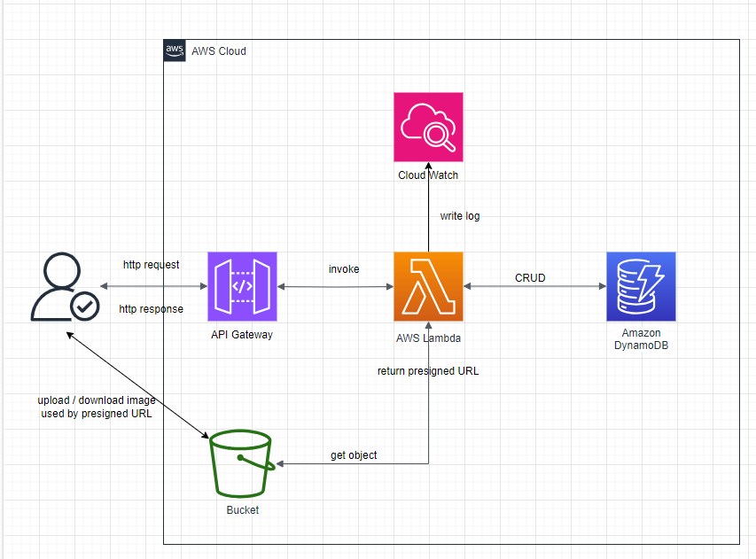

# 5 章 記事一覧取得 API の作成

こちらの章では記事一覧取得 API を作成していきたいと思います。
その前に、AWS SAM を利用するうえで使用する技術などの基礎知識について解説していきたいと思います。

## AWS SAM とは

AWS Serverless Application Model (AWS SAM) は、[公式ドキュメント](https://docs.aws.amazon.com/ja_jp/serverless-application-model/latest/developerguide/what-is-sam.html)によると、サーバーレスアプリケーションの構築と実行における開発者の操作性を向上させるツールキットであると定義されています。

公式ドキュメントに一度目を通すと、全体の概要がなんとなくわかると思いますが、簡潔にまとめると以下のような特徴が挙げられます。

- AWS SAM テンプレート(template.yaml)という概念でアプリケーションのインフラ環境をコードベースで管理できる。
- ローカル環境でデバッグとテストができ、アプリケーションをデプロイすることもできる

また、サーバーレスという用語の概念に疑問を持つ方がいると思います。以下はサーバーレスアーキテクチャの特徴です。

- 開発者が独自のサーバーを管理することがなく、アプリケーションの構築・実行が可能
  - 例えば、アプリケーションサーバーを EC2 で管理するとなると、サーバーのメンテナンスやスケーリングを自分自身で管理する必要が出てきます。サーバーレスアーキテクチャではこの管理の必要がありません。
  - また、EC2 などは常時起動しているため起動している時間だけ料金が課金されてしまいますが、サーバーレスアーキテクチャではイベントが発生した時間の分だけ料金が課金されるためコストにも優しいのが特徴です。
- [イベント駆動型のアーキテクチャ](https://aws.amazon.com/jp/event-driven-architecture/)であり、分離された各サービス間でイベントをトリガーにして通信を行うという特徴があります。
  - 教材のアーキテクチャはシンプルなものになっていますが、以下のようなインフラ図の構成で各サービス間で通信を行います。
    

## SAM で利用する AWS のサービス

- AWS Lambda
  - https://www.sunnycloud.jp/column/20239117-01/
    - 上記の記事の「サーバーレスの関数置き場」という表現が分かりやすい！
- API Gateway
  - https://qiita.com/shimajiri/items/2fb424629d9ddb9c9ef1
    - フルマネージドの Web サービスで、簡単に API の作成、公開、保守、モニタリング、保護ができるサービス。
- Dynamo DB
  - https://www.sunnycloud.jp/column/20210228-01/
    - ドキュメント型の NoSQL のサービス
      - NoSQL
        - MySQL などのリレーショナルデータベースとは全く異なり、非構造化データ・半構造化データなど柔軟なデータを扱える
      - ドキュメント型
        - SON や XML などの記述書式で書かれた不定形なデータを管理するデータベース
- S3
  - https://www.wafcharm.com/jp/blog/s3-for-beginners/#:~:text=%E3%81%A7%E3%81%8D%E3%82%8B%E3%81%A7%E3%81%97%E3%82%87%E3%81%86%E3%80%82-,S3%E3%81%A8%E3%81%AF%EF%BC%9F%E5%88%9D%E5%BF%83%E8%80%85%E3%81%AB%E3%82%82%E3%82%8F%E3%81%8B%E3%82%8A%E3%82%84%E3%81%99%E3%81%8F%E8%A7%A3%E8%AA%AC,-S3%E3%81%A8%E3%81%AF
    - AWS のストレージサービス
- cloud watch
  - https://aws.amazon.com/jp/cloudwatch/#:~:text=Amazon%20CloudWatch%20%E3%81%AF%E3%80%81%E3%82%A2%E3%83%97%E3%83%AA%E3%82%B1%E3%83%BC%E3%82%B7%E3%83%A7%E3%83%B3%E3%82%92,%E3%82%92%E6%8F%90%E4%BE%9B%E3%81%99%E3%82%8B%E3%82%B5%E3%83%BC%E3%83%93%E3%82%B9%E3%81%A7%E3%81%99%E3%80%82
