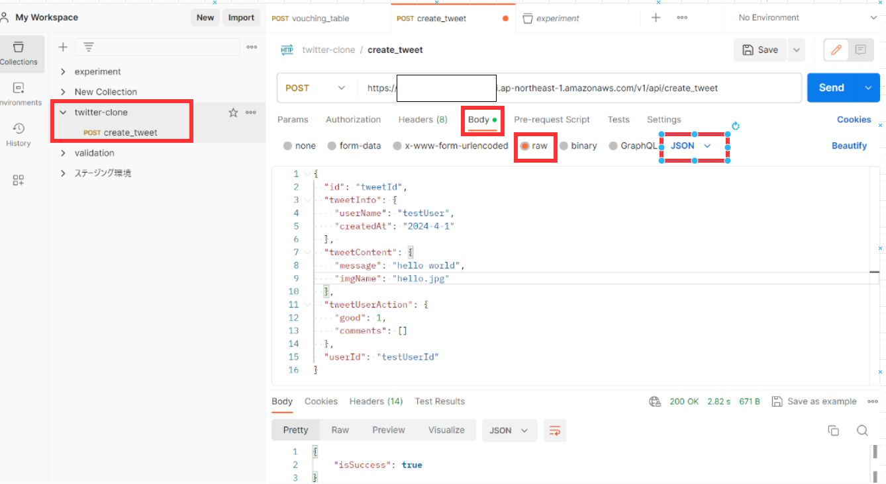
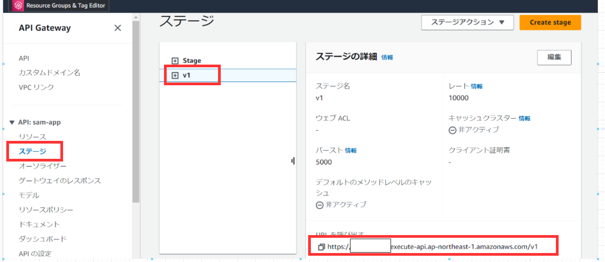
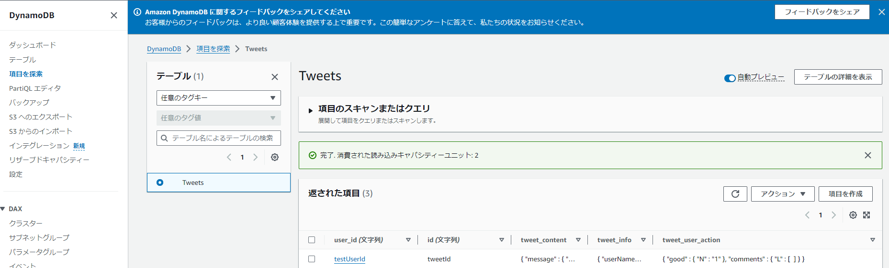
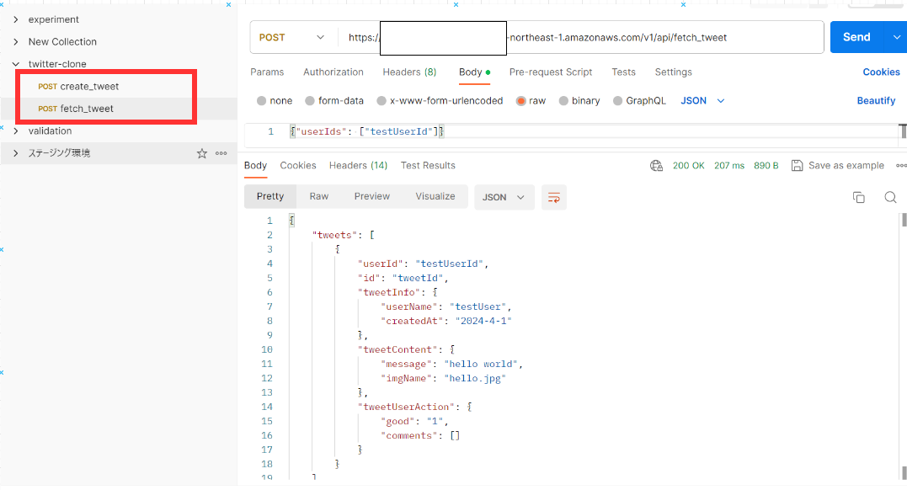
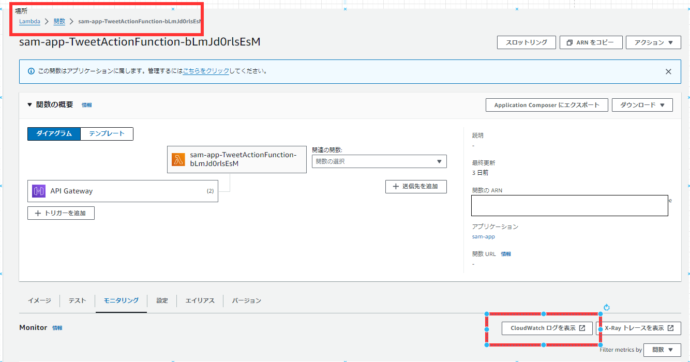
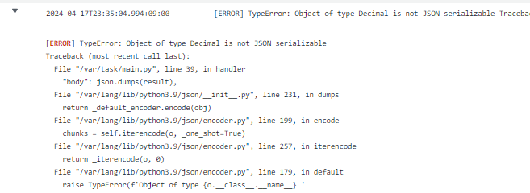

# ツイート投稿 API

こちらの章ではツイート投稿 API を作成していきたいと思います。
前回の章では、初めて学習する内容が多かったため、かなりボリューミーな章になっていたと思いますが、今回の 6 章はそれほど重くありません！

## API の実装

まずは template.yaml を編集していきます。
ツイート作成もツイート取得 API も同じ Image にまとめるため、TweetActionFunction でひとくくりにしています。こうすることで以下のようなメリットがあります。

- lambda Function を 1 つ増やす必要がない
- Docker Image が実質 1 つ追加せずに済むためビルド時間の削減
- template.yaml の記述がすっきりまとまる

基本的に Docker イメージの中で利用するパッケージやライブラリが同じような lambda や、API の役割が近しい lambda については複数のイベントを 1 つの lambda にまとめてしまってよいと思います。

````yaml
```yaml
AWSTemplateFormatVersion: "2010-09-09"
Transform: AWS::Serverless-2016-10-31
Description: >
  python3.9

  Sample SAM Template for backend

Globals:
  Function:
    Timeout: 30
    MemorySize: 128
Parameters:
  StageName:
    Type: "String"
    Default: "v1"
  TweetsTableName:
    Type: String
    Default: "Tweets"
  LogRetentionInDays:
    Type: Number
    Default: 1
Resources:
  MyApi:
    Type: AWS::Serverless::Api
    Properties:
      StageName: !Ref StageName
      MethodSettings:
        - DataTraceEnabled: false
          ResourcePath: "/*"
          HttpMethod: "*"
      Cors:
        AllowOrigin: "'*'"
        AllowCredentials: false
        AllowMethods: "'OPTIONS,POST'"
        AllowHeaders: "'Content-Type,X-CSRF-TOKEN,Access-Control-Allow-Origin'"
  TweetActionFunction:
    Type: AWS::Serverless::Function
    Properties:
      Policies:
        - arn:aws:iam::aws:policy/AmazonDynamoDBFullAccess
      PackageType: Image
      Events:
# -------------------------追加-----------------------------
        TweetActionCreate:
          Type: Api
          Properties:
            RestApiId: !Ref MyApi
            Path: /api/create_tweet
            Method: post
# ------------------------------------------------------
        TweetActionFetch:
          Type: Api
          Properties:
            RestApiId: !Ref MyApi
            Path: /api/fetch_tweet
            Method: post
      Environment:
        Variables:
          DYNAMO_ENDPOINT_URL: "http://dynamodb.ap-northeast-1.amazonaws.com"
    Metadata:
      Dockerfile: ./tweet/Dockerfile
      DockerContext: ./
      DockerTag: python3.9-v1
  TweetActionLogGroup:
    Type: AWS::Logs::LogGroup
    Properties:
      LogGroupName: !Sub /aws/lambda/${TweetActionFunction}
      RetentionInDays: !Ref LogRetentionInDays
      Tags:
        - Key: TwitterLikeSnsDeveloper
          Value: Green
  Tweets:
    Type: AWS::DynamoDB::Table
    Properties:
      TableName: !Ref TweetsTableName
      AttributeDefinitions:
        - AttributeName: user_id
          AttributeType: S
        - AttributeName: id
          AttributeType: S
      KeySchema:
        - AttributeName: user_id
          KeyType: HASH
        - AttributeName: id
          KeyType: RANGE
      BillingMode: PAY_PER_REQUEST
      PointInTimeRecoverySpecification:
        PointInTimeRecoveryEnabled: true
Outputs:
  FetchTweetApi:
    Description: "API Gateway endpoint URL for Prod stage for TweetAction function"
    Value: !Sub "https://${MyApi}.execute-api.${AWS::Region}.amazonaws.com/${StageName}/api/fetch_tweet/"
# -------------------------追加-----------------------------
  CreateTweetApi:
    Description: "API Gateway endpoint URL for Prod stage for TweetAction function"
    Value: !Sub "https://${MyApi}.execute-api.${AWS::Region}.amazonaws.com/${StageName}/api/create_tweet/"
# ---------------------------------------------------------
  TweetActionFunction:
    Description: "Tweet Action Function Lambda Function ARN"
    Value: !GetAtt TweetActionFunction.Arn
  TweetActionFunctionIamRole:
    Description: "Implicit IAM Role created for Tweet Action Function function"
    Value: !GetAtt TweetActionFunctionRole.Arn
````

続いて`backend/tweet/main.py`を編集していきます。

```python
import json
import logging

from fetch_tweet_handler import fetch_tweet_handler
# この次に実装するファイル
from create_tweet_handler import create_tweet_handler


# main.pyにはhandler関数を実装し、これがイベント検知したときに実行する関数になる。
def handler(event, context):
    """tweet作成ラムダ."""
    handler_mapping = {
        # 以下を追加
        "/api/create_tweet": create_tweet_handler,
        "/api/fetch_tweet": fetch_tweet_handler,
    }
    try:
        path = event["path"]
        payload = json.loads(event["body"])

        handler = handler_mapping[path]

        result = handler(payload)
        status_code = 200

    except Exception as e:
        logging.exception(e)
        status_code = 500
        result = {"message": "InternalServerError"}

    finally:
        return {
            "isBase64Encoded": False,
            "statusCode": status_code,
            "headers": {
                # ここらへんは先ほど設定したCORS関連のもの
                "Access-Control-Allow-Origin": "*",
                "Access-Control-Allow-Methods": "OPTIONS, POST",
                "Access-Control-Allow-Headers": "Content-Type",
            },
            "body": json.dumps(result),
        }

```

続いて`backend/tweet/create_tweet.py`を追加します。
dynamodb へ直接 put するだけのかなりシンプルな作りになっています。

```python
import logging

from db.table import get_table


def create_tweet_handler(payload: dict):
    """tweet作成ラムダ."""
    get_table("Tweets").put_item(
        Item={
            "user_id": payload["userId"],
            "id": payload["id"],
            "tweet_info": payload["tweetInfo"],
            "tweet_content": payload["tweetContent"],
            "tweet_user_action": payload["tweetUserAction"],
        },
    )

    return {"isSuccess": True}

```

そして、作成した`create_tweet.py`を Dockerfile の COPY で追加します。

```Dockerfile
#####省略######
COPY ./db/table.py ${LAMBDA_TASK_ROOT}/db/table.py
COPY ./db/utils.py ${LAMBDA_TASK_ROOT}/db/utils.py
######ここに追加#######
COPY tweet/create_tweet_handler.py ${LAMBDA_TASK_ROOT}/create_tweet.py
#####省略######

```

## 動作検証

ここまで実装できたら、動作確認してみましょう。

SAM で作成した API はローカル環境でも動作確認をすることは可能ですが、dynamodb や s3 という要素が関わってくると一筋縄ではいきません。
実際に Dynamodb-local や minio といったエミュレータを利用して AWS 上と同じような環境をローカル環境に構築することもできますが、今回は AWS 上にデプロイした api を postman というサービスを利用して動作確認しましょう。

まず、デプロイを実行します。SAM CLI はとても素晴らしく、簡単なコマンド操作一発でデプロイまで完結します。

```bash
# backend直下で実行
$ sam build

Build Succeeded

Built Artifacts  : .aws-sam/build
Built Template   : .aws-sam/build/template.yaml

Commands you can use next
=========================
[*] Validate SAM template: sam validate
[*] Invoke Function: sam local invoke
[*] Test Function in the Cloud: sam sync --stack-name {{stack-name}} --watch
[*] Deploy: sam deploy --guided

# 最後の行に記載されたsam deploy --guidedを実行します。
$ sam deploy --guided

Configuring SAM deploy
======================

        Looking for config file [samconfig.toml] :  Found
        Reading default arguments  :  Success

        Setting default arguments for 'sam deploy'
        =========================================
        # 以下から対話形式で進めていきます。Y,Nの記載がない箇所はデフォルト設定のままということでそのままEnterを押下してください。
        Stack Name [backend]:
        AWS Region [ap-northeast-1]:
        Parameter StageName [v1]:
        Parameter TweetsTableName [Tweets]:
        Parameter LogRetentionInDays [1]:
        #Shows you resources changes to be deployed and require a 'Y' to initiate deploy
        Confirm changes before deploy [Y/n]: Y
        #SAM needs permission to be able to create roles to connect to the resources in your template
        Allow SAM CLI IAM role creation [Y/n]: Y
        #Preserves the state of previously provisioned resources when an operation fails
        Disable rollback [y/N]: y
        TweetActionFunction1 has no authentication. Is this okay? [y/N]: y
        Save arguments to configuration file [Y/n]: Y
        SAM configuration file [samconfig.toml]:
        SAM configuration environment [default]:
```

デプロイは成功しましたでしょうか？デプロイが成功すると、backend 直下に`samconfig.toml`ファイルが作成されていることが分かると思います。
こちらのファイルは今後`sam deploy`する際の設定ファイルとなります。template.yaml の更新がない python コードの変更分だけを反映させたいときは 2 回目以降のデプロイには`--guided`オプションを付ける必要がありません。
2 回目以降に`sam deploy`を実行するときは`samconfig.toml`ファイルの設定を参照してデプロイが実行されます。

それではデプロイが完了したので、postman を利用して API へリクエストを送ってみましょう。

[postman はこちら](https://www.postman.com/)

以下のリクエストを作成します。


上記キャプチャの赤枠部分を編集してください。
リクエストを送る URL 部分の確認方法について、解説します。
AWS のマネジメントコンソールを開いて API Gateway を開き、以下の赤枠部分の URL をコピーして貼り付けます。

あとは`api/create_tweet`を URL の末尾に付けるだけですね。

リクエストで送る json は以下になります。

注意："good": "1"と文字列型になっていますが、この理由は dynamodb は数値を登録すると`Decimal(1)`のようなデータ形式で登録されます。
この`Decimal(1)`のようなデータを直接 json 形式に python で dump すると、エラーとなってしまい、回避するためのコードを書く必要があり、今回は手間なので文字列型にしています。
フロントエンド側で数値として扱いたくなった場合は、typescript で Number 型にキャストするなど対応してください。

```json
{
  "id": "tweetId",
  "tweetInfo": {
    "userName": "testUser",
    "createdAt": "2024-4-1"
  },
  "tweetContent": {
    "message": "hello world",
    "imgName": "hello.jpg"
  },
  "tweetUserAction": {
    "good": "1",
    "comments": []
  },
  "userId": "testUserId"
}
```

SEND したら成功しましたでしょうか？
成功していたら DynamoDB を確認してみましょう。マネジメントコンソールから DynamoDB を開きます。


1 件データが作成されていたら OK です！

ではこの作成したデータをツイート取得 API を使って取得してみましょう！


上記のようにレスポンスデータが返却されていれば OK です。

色々なデータで試してみたい方は、postman でリクエストデータを色々と変えながら実行してみてください！

## Tips

- lambda を実行してエラーになった場合はどうやって調査する？
  - A.　 CloudWatch Logs に出力されたログを確認することでエラーの内容が分かります。
    
    調査したい lambda 関数を開いて、モニタリングタブから`CloudWatch ログを表示`をクリックするとログが見れます。
    エラーがあると以下のような python の Traceback が見れるのでエラーの発生箇所を特定することが可能になります。
    

## まとめ

お疲れ様でした！これでツイート作成と取得の API は作成が完了しましたね！
残すは画像アップロード・ダウンロード系の API ですね。
あと少しで教材自体は完了しますので、頑張りましょう！
