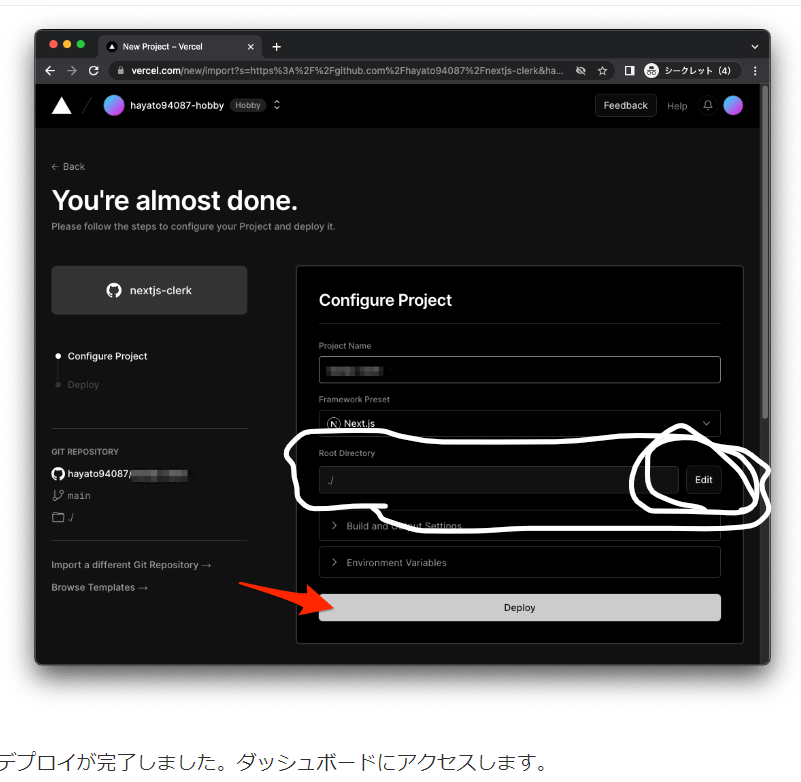
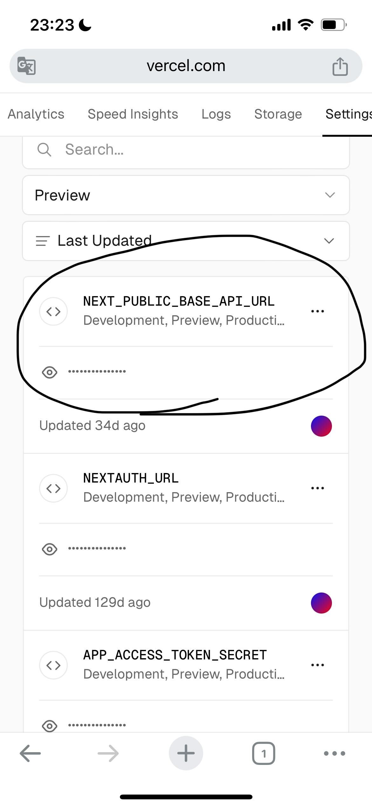
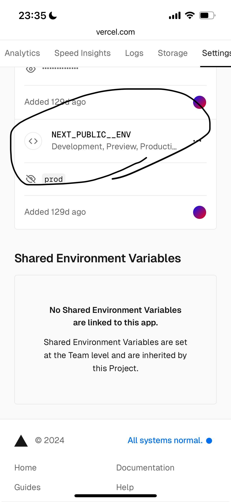

# vercel へのデプロイ

こちらで最後の章になりますが、next.js で作成したフロントエンドの画面を vercel へデプロイしていきましょう。
デプロイは簡単なので、以下の手順に従って進めましょう。

## 1.vercel に登録

https://zenn.dev/hayato94087/articles/b30efe589baa0e

`※注意`

白枠で囲った部分のルートディレクトリの部分は Edit を押下して編集しましょう。というのも今回フロントエンド画面のディレクトリは`frontend`配下となるので、そちらを指定してください。

## 2.環境変数の設定

- 以下画像の 1 枚目の base_api_url のところはポストマンから叩いていた api gateway の url
  
- 以下の画像は prod → 添付画像だと NEXT_PUBLIC_ENV のところがタイポでアンダーバー 2 個になってしまってるので、適宜調整お願い致します。
  
- 他の環境変数は個人的に google の oauth を利用するためのものなので気にしないでください！

## 3. temlate.yaml の s3 の allow origin にデプロイした vercel の url を指定する。

- 最後の画像で丸した箇所から受講者様が vercel にデプロイしたアプリへアクセスして、その url を指定する。
  

- 上記完了後に`sam build`と`sam deploy`を実行してください。
