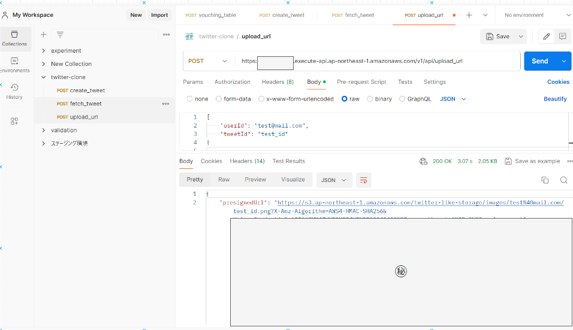
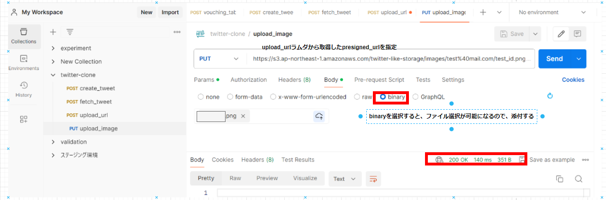
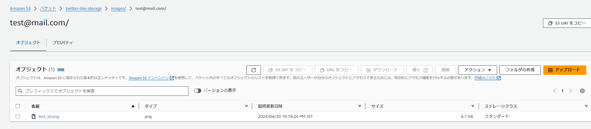
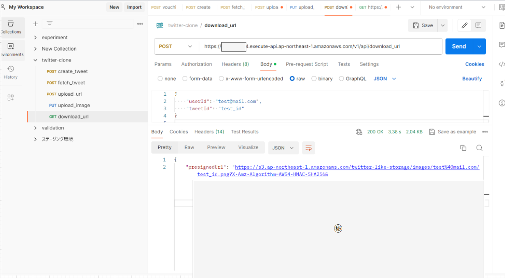
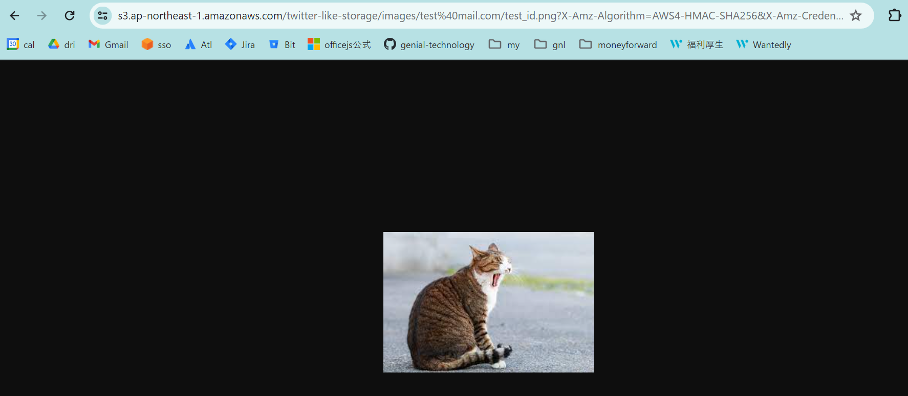

# 画像アップロード・ダウンロード API

## API の実装

まずは template.yaml を編集していきます。

S3 を追加するのと、アップロード・ダウンロード URL 取得 API の追加を行います。

```yaml
AWSTemplateFormatVersion: "2010-09-09"
Transform: AWS::Serverless-2016-10-31
Description: >
  python3.9

  Sample SAM Template for backend

Globals:
  Function:
    Timeout: 30
    MemorySize: 128
Parameters:
  StageName:
    Type: "String"
    Default: "v1"
  TweetsTableName:
    Type: String
    Default: "Tweets"
  LogRetentionInDays:
    Type: Number
    Default: 1
Resources:
  MyApi:
    Type: AWS::Serverless::Api
    Properties:
      StageName: !Ref StageName
      MethodSettings:
        - DataTraceEnabled: false
          ResourcePath: "/*"
          HttpMethod: "*"
      Cors:
        AllowOrigin: "'*'"
        AllowCredentials: false
        AllowMethods: "'OPTIONS,POST'"
        AllowHeaders: "'Content-Type,X-CSRF-TOKEN,Access-Control-Allow-Origin'"
  TweetActionFunction:
    Type: AWS::Serverless::Function
    Properties:
      Policies:
        - arn:aws:iam::aws:policy/AmazonDynamoDBFullAccess
      PackageType: Image
      Events:
        TweetActionCreate:
          Type: Api
          Properties:
            RestApiId: !Ref MyApi
            Path: /api/create_tweet
            Method: post
        TweetActionFetch:
          Type: Api
          Properties:
            RestApiId: !Ref MyApi
            Path: /api/fetch_tweet
            Method: post
      Environment:
        Variables:
          DYNAMO_ENDPOINT_URL: "http://dynamodb.ap-northeast-1.amazonaws.com"
    Metadata:
      Dockerfile: ./tweet/Dockerfile
      DockerContext: ./
      DockerTag: python3.9-v1
  TweetActionLogGroup:
    Type: AWS::Logs::LogGroup
    Properties:
      LogGroupName: !Sub /aws/lambda/${TweetActionFunction}
      RetentionInDays: !Ref LogRetentionInDays
      Tags:
        - Key: TwitterLikeSnsDeveloper
          Value: Green

  # -------------------------追加ここから-----------------------------
  GeneratePresignedUrlFunction:
    Type: AWS::Serverless::Function
    Properties:
      Policies:
        - S3CrudPolicy:
            BucketName: twitter-like-storage
      PackageType: Image
      Events:
        GeneratePresignedUrl:
          Type: Api
          Properties:
            RestApiId: !Ref MyApi
            Path: /api/upload_url
            Method: post
        GenerateDownloadUrl:
          Type: Api
          Properties:
            RestApiId: !Ref MyApi
            Path: /api/download_url
            Method: post
      Environment:
        Variables:
          S3_BUCKET_NAME: "twitter-like-storage"
          S3_ENDPOINT_URL: "https://s3.ap-northeast-1.amazonaws.com"
    Metadata:
      Dockerfile: ./presigned_url/Dockerfile
      DockerContext: ./
      DockerTag: python3.9-v1

  GeneratePresignedUrlLogGroup:
    Type: AWS::Logs::LogGroup
    Properties:
      LogGroupName: !Sub /aws/lambda/${GeneratePresignedUrlFunction}
      RetentionInDays: !Ref LogRetentionInDays
      Tags:
        - Key: TwitterLikeSnsDeveloper
          Value: Green
  # -----------------ここまで--------------------------------------------
  Tweets:
    Type: AWS::DynamoDB::Table
    Properties:
      TableName: !Ref TweetsTableName
      AttributeDefinitions:
        - AttributeName: user_id
          AttributeType: S
        - AttributeName: id
          AttributeType: S
      KeySchema:
        - AttributeName: user_id
          KeyType: HASH
        - AttributeName: id
          KeyType: RANGE
      BillingMode: PAY_PER_REQUEST
      PointInTimeRecoverySpecification:
        PointInTimeRecoveryEnabled: true
  # -------------------------追加-----------------------------
  S3:
    Type: AWS::S3::Bucket
    Properties:
      BucketName: twitter-like-storage
      VersioningConfiguration: # バージョニングを有効化
        Status: Enabled
      CorsConfiguration:
        CorsRules:
          - AllowedHeaders:
              - "*"
            AllowedMethods:
              - PUT
              - GET
            AllowedOrigins:
              - "https://twitter-clone.vercel.app" # vercelにデプロイ後に正しいURLに更新すること
            MaxAge: 3000
  # ---------------------------------------------------------

Outputs:
  FetchTweetApi:
    Description: "API Gateway endpoint URL for Prod stage for TweetAction function"
    Value: !Sub "https://${MyApi}.execute-api.${AWS::Region}.amazonaws.com/${StageName}/api/fetch_tweet/"
  CreateTweetApi:
    Description: "API Gateway endpoint URL for Prod stage for TweetAction function"
    Value: !Sub "https://${MyApi}.execute-api.${AWS::Region}.amazonaws.com/${StageName}/api/create_tweet/"
  # -------------------------追加-----------------------------
  GeneratePresignedUrlApi:
    Description: "API Gateway endpoint URL for Prod stage for Generate Presigned Url function"
    Value: !Sub "https://${MyApi}.execute-api.${AWS::Region}.amazonaws.com/${StageName}/api/upload_url/"
  GenerateDownloadUrlApi:
    Description: "API Gateway endpoint URL for Prod stage for Generate Download Url function"
    Value: !Sub "https://${MyApi}.execute-api.${AWS::Region}.amazonaws.com/${StageName}/api/download_url/"
  # ---------------------------------------------------------
  TweetActionFunction:
    Description: "Tweet Action Function Lambda Function ARN"
    Value: !GetAtt TweetActionFunction.Arn
  # -------------------------追加-----------------------------
  GeneratePresignedUrlFunction:
    Description: "Generate Presigned Url Lambda Function ARN"
    Value: !GetAtt GeneratePresignedUrlFunction.Arn
  # ---------------------------------------------------------
  TweetActionFunctionIamRole:
    Description: "Implicit IAM Role created for Tweet Action Function function"
    Value: !GetAtt TweetActionFunctionRole.Arn
  # -------------------------追加-----------------------------
  GeneratePresignedUrlFunctionIamRole:
    Description: "Implicit IAM Role created for Generate Presigned Url function"
    Value: !GetAtt GeneratePresignedUrlFunctionRole.Arn
  # ---------------------------------------------------------
```

続いて、Dockerfile や python ファイルの追加を行っていきましょう。

```bash
$ cd backend
$ mkdir presigned_url && cd presigned_url && touch {Dockerfile,download_url_handler.py,upload_url_handler.py,main.py}
```

Dockerfile を編集します。

```Dockerfile
FROM public.ecr.aws/lambda/python:3.9


COPY presigned_url/requirements.txt ${LAMBDA_TASK_ROOT}/requirements.txt
RUN python3.9 -m pip install --no-cache-dir -r "${LAMBDA_TASK_ROOT}/requirements.txt" -t .

COPY presigned_url/main.py ${LAMBDA_TASK_ROOT}/main.py
COPY presigned_url/download_url_handler.py ${LAMBDA_TASK_ROOT}/download_url_handler.py
COPY presigned_url/upload_url_handler.py ${LAMBDA_TASK_ROOT}/upload_url_handler.py

COPY ./utils/s3_client.py ${LAMBDA_TASK_ROOT}/utils/s3_client.py

CMD ["main.handler"]

```

次に requirements.txt を作成していきましょう。5 章で作成した同じ手順で進めましょう。

```bash
$ cd presigned_url
$ poetry init
$ poetry add boto3
$ poetry export -f requirements.txt --output requirements.txt
```

上記を実行して`presigned_url/requirements.txt`が作成できましたでしょうか。

続いて python ファイルを編集していきたいと思います。

`backend/utils/s3_client.py`

utils フォルダを作成し、 S3 へアクセスするオブジェクトを取得する共通関数を定義したファイルを作成します。

```python
import os

import boto3
from botocore.client import Config


def get_s3_client() -> boto3.client:
    """S3のClientを生成."""

    return boto3.client(
        service_name="s3",
        endpoint_url=os.getenv("S3_ENDPOINT_URL"),
        config=Config(signature_version="s3v4"),
    )

```

`presigned_url/main.py`

main.py ではイベントから受け取ったパスをもとにアップロード or ダウンロード URL 取得処理を実行するような形となっております。

```python
import json
import logging

from download_url_handler import handler as download_url_handler
from upload_url_handler import handler as upload_url_handler


def handler(event, context):
    """
    署名付きURLの発行ラムダ.
    """
    handler_mapping = {
        "/api/download_url": download_url_handler,
        "/api/upload_url": upload_url_handler,
    }
    try:
        path = event["path"]
        payload = json.loads(event["body"])

        handler = handler_mapping[path]
        result = handler(payload)

        status_code = 200

    except Exception as e:
        logging.exception(e)
        status_code = 500
        result = {"message": "InternalServerError"}

    finally:
        return {
            "isBase64Encoded": False,
            "statusCode": status_code,
            "headers": {
                "Access-Control-Allow-Origin": "*",
                "Access-Control-Allow-Methods": "OPTIONS, POST",
                "Access-Control-Allow-Headers": "Content-Type",
            },
            "body": json.dumps(result),
        }

```

`presigned_url/upload_url_handler.py`

アップロード URL 取得 API の処理自体はとても単純で、S3 へ画像を保存するパスを指定して、presigned_url を取得する形になります。

アップロード先のパスの構成としては、s3 に`images`フォルダを作成して、その配下に`{userId}/{tweetId}.png`を配置するような構成となっております。

```python
import os

from utils.s3_client import get_s3_client

URL_EXPIRE_TIME = 1800


def handler(payload: dict):
    """
    署名付きURLの発行ラムダ.

    /api/upload_url
    """
    generated_presigned_url = get_s3_client().generate_presigned_url(
        ClientMethod="put_object", # put_object用のURL取得
        Params={
            "Bucket": os.getenv("S3_BUCKET_NAME"),
            "Key": "images/" + payload["userId"] + "/" + payload["tweetId"] + ".png",
        },
        ExpiresIn=URL_EXPIRE_TIME,
    )

    result = {
        "presignedUrl": generated_presigned_url,
    }

    return result

```

`presigned_url/download_url_handler.py`

こちらのダウンロード URL 取得処理もアップロード URL の処理とはほとんど変わりません。
異なるのは`generate_presigned_url`の ClientMethod が get_object になったぐらいです。

```python
import os

from utils.s3_client import get_s3_client

URL_EXPIRE_TIME = 1800


def handler(payload: dict):
    """
    署名付きURLの発行ラムダ.

    /api/download_url
    """
    generated_download_url = get_s3_client().generate_presigned_url(
        ClientMethod="get_object",  # get_object用のURL取得
        Params={
            "Bucket": os.getenv("S3_BUCKET_NAME"),
            "Key": "images/" + payload["userId"] + "/" + payload["tweetId"] + ".png",
        },
        ExpiresIn=URL_EXPIRE_TIME,
    )

    result = {
        "presignedUrl": generated_download_url,
    }

    return result

```

ここまでできたらコードをビルドしましょう。

```bash
$ sam build

# ------------省略----------------
Successfully built 39244f05c518
Successfully tagged tweetactionfunction:python3.9-v1


Build Succeeded

Built Artifacts  : .aws-sam/build
Built Template   : .aws-sam/build/template.yaml

Commands you can use next
=========================
[*] Validate SAM template: sam validate
[*] Invoke Function: sam local invoke
[*] Test Function in the Cloud: sam sync --stack-name {{stack-name}} --watch
[*] Deploy: sam deploy --guided
```

上記のようにビルドが成功したら以下コマンドを実行し、追加分をデプロイします。

```bash
# ssoでログインが完了している状態で以下を実行
$ sam deploy --guided

ubuntu@GT-Vostro-10:~/study/clone-app/backend$ sam deploy --guided

Configuring SAM deploy
======================

        Looking for config file [samconfig.toml] :  Found
        Reading default arguments  :  Success

        Setting default arguments for 'sam deploy'
        =========================================
        Stack Name [backend]:
        AWS Region [ap-northeast-1]:
        Parameter StageName [v1]:
        Parameter TweetsTableName [Tweets]:
        Parameter LogRetentionInDays [1]:
        #Shows you resources changes to be deployed and require a 'Y' to initiate deploy
        Confirm changes before deploy [Y/n]: Y
        #SAM needs permission to be able to create roles to connect to the resources in your template
        Allow SAM CLI IAM role creation [Y/n]: Y
        #Preserves the state of previously provisioned resources when an operation fails
        Disable rollback [Y/n]: Y
        TweetActionFunction has no authentication. Is this okay? [y/N]: y
        TweetActionFunction has no authentication. Is this okay? [y/N]: y
        GeneratePresignedUrlFunction has no authentication. Is this okay? [y/N]: y
        GeneratePresignedUrlFunction has no authentication. Is this okay? [y/N]: y
        Save arguments to configuration file [Y/n]: Y
        SAM configuration file [samconfig.toml]:
        SAM configuration environment [default]:
```

## 動作確認

### アップロード URL 取得

では、AWS へデプロイが完了したので、tweet 取得や作成 API の動作確認時と同様に POSTMAN で動作確認をしていきましょう。

リクエストボディは以下を設定してください。

```json
{
  "userId": "test@mail.com",
  "tweetId": "test_id"
}
```



### 画像アップロード

アップロード用の URL が取得できたので、せっかくなら実際に画像をアップロードしてみましょう。

以下手順でアップロードまで実行してください。

- http メソッドは`PUT`
- 先ほど取得したアップロード用 URL を指定する
- リクエストボディにバイナリーデータを添付する（ファイル選択が可能なので添付）
- Send してレスポンスで「200OK」となっていることを確認



また、実際に S3 でアップロードした画像を確認してみましょう



上記のようにアップロードした画像が表示されていれば OK です。

### ダウンロード URL 取得

では、動作確認の最後に



取得したダウンロード URL をブラウザに入力して検索すると、実際にアップロードした画像が確認できると思います。


## 最後に

お疲れ様でした。これで 7 章も完了し、バックエンド側の API も全て作成できました。

次の章でフロント側で作成したアプリをデプロイして、実際に本番環境上で正常に twitter クローンアプリが動くかを確認していきましょう。
